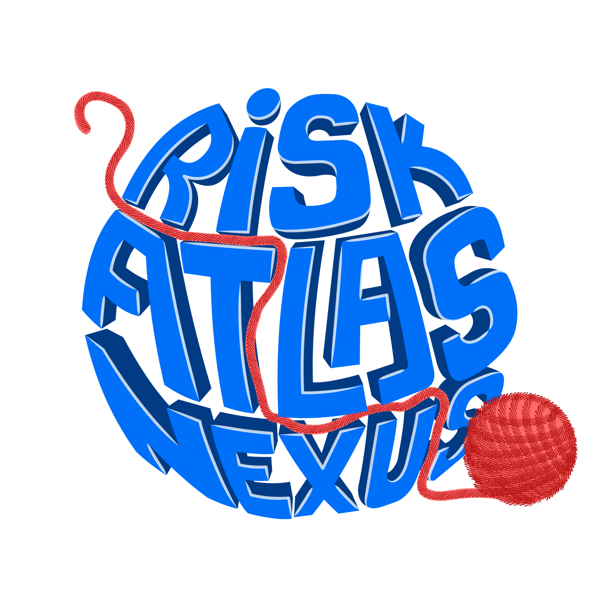
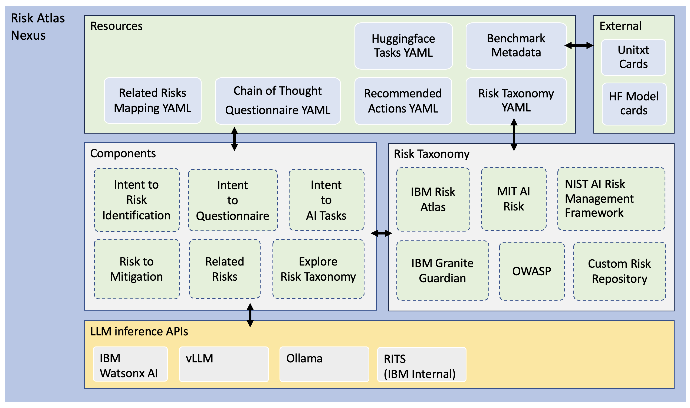

# Risk Atlas Nexus



[](https://www.apache.org/licenses/LICENSE-2.0)  [](https://www.python.org/downloads/) </a>

## Overview
Risk Atlas Nexus aims to provide tooling to help bring together disparate resources related to governance of foundation models. We support a community driven approach to curating and cataloguing resources such as datasets, benchmarks and mitigations.  Our goal is to turn abstract risk definitions into actionable workflows that streamline AI governance processes. By connecting fragmented resources, Risk Atlas Nexus seeks to fill a critical gap in AI governance, enabling stakeholders to build more robust, transparent, and accountable systems. Risk Atlas Nexus builds on the [IBM AI Risk Atlas](https://www.ibm.com/docs/en/watsonx/saas?topic=ai-risk-atlas) making this educational resource a nexus of governance assets and tooling.  An AI System's Knowledge Graph is used to provide a unified structure that links and contextualize the very heterogeneous domain data. 

Our intention is to create a starting point for an open AI Systems ontology whose focus is on risk and that the community can extend and enhance. This ontology serves as the foundation that unifies innovation and tooling in the AI risk space. By lowering the barrier to entry for developers, it fosters a governance-first approach to AI solutions, while also inviting the broader community to contribute their own tools and methodologies to expand its impact.

## Features
- 🏗️📊 An ontology has been provided, that combines the AI risk view (taxonomies, risks, actions) with an AI model view (AI systems, AI models, model evaluations) into one coherent schema 
- 📚⚠️ AI Risks were collected from IBM AI Risk Atlas, IBM Granite Guardian, MIT AI Risk Repository, NIST Artificial Intelligence Risk Management Framework: Generative Artificial Intelligence Profile, the AI Risk Taxonomy (AIR 2024), and OWASP Top 10 for Large Language Model Applications
- 🔗📌 Mappings are proposed between the taxonomies and between risks and actions
- 🐍🔍 Use the python library methods to quickly explore available risks, relations and actions 
- 🚨🧐 Use the python library methods to detect potential risks in your usecase 
- 📤📈 Download an exported graph populated with data instances

## Architecture


### Coming soon
- Tooling to convert the LinkML schema and instance data into a Cypher representation to populate a graph database


## Links
- **AI Risk Ontology**
    - [LinkML schema documentation](docs/ontology/index.md)
    - [LinkML instance data for an example knowledge graph](src/risk_atlas_nexus/data/knowledge_graph/README.md)
    - [Download a populated graph](graph_export/README.md)
    - [Contribute your own taxonomy files and CoT templates](docs/Contributing_a_taxonomy.md)
- **Notebooks:** 
    - [Risk Atlas Nexus Quickstart](examples/notebooks/Risk_Atlas_Nexus_Quickstart.ipynb) Overview of library functionality
    - [Risk identification](examples/notebooks/risk_identification.ipynb) Uncover risks related to your usecase
    - [Auto assist questionnaire](examples/notebooks/autoassist_questionnaire.ipynb) Auto-fill questionnaire using Chain of Thought or Few-Shot Examples
    - [AI Tasks identification](examples/notebooks/ai_tasks_identification.ipynb) Uncover ai tasks related to your usecase
- **Additional Resources:**
    - [IBM AI Risk Atlas](https://www.ibm.com/docs/en/watsonx/saas?topic=ai-risk-atlas)
    - [Usage Governance Advisor: From Intent to AI Governance](https://arxiv.org/abs/2412.01957)


## Installation
This project targets python version ">=3.11, <3.12". You can download specific versions of python here: https://www.python.org/downloads/

Install the risk_atlas_nexus library
```
git clone git@github.com:IBM/risk-atlas-nexus.git
cd risk-atlas-nexus
python -m venv vrisk-atlas-nexus
source vrisk-atlas-nexus/bin/activate
pip install -e .
```

### Install for inference APIs

Risk Atlas Nexus uses Large Language Models (LLMs) to infer risks and risks data. Therefore, requires access to LLMs to inference or call the model. The following LLM inference APIs are supported:

- [IBM Watsonx AI](https://www.ibm.com/products/watsonx-ai) (Watson Machine Learning)
- [Ollama](https://ollama.com/)
- [vLLM](https://docs.vllm.ai/en/latest/)
- [RITS](https://rits.fmaas.res.ibm.com) (IBM Internal Only)

#### IBM Watsonx AI (WML) 

When using the WML platform, you need to:

1. Add configuration to `.env` file as follows. Please follow this [documentation](https://dataplatform.cloud.ibm.com/docs/content/wsj/analyze-data/fm-credentials.html?context=wx&locale=en) on obtaining WML credentials.

```yaml
WML_API_KEY=<WML api key goes here>
WML_API_URL=<WML url key goes here>
WML_PROJECT_ID=<WML project id goes here, Optional>
WML_SPACE_ID=<WML space id goes here, Optional>
```

Either 'WML_PROJECT_ID' or 'WML_SPACE_ID' need to be specified.

2. Install WML dependencies as follows:

```command
pip install -e ".[wml]"
```

#### Ollama 

When using the Ollama inference, you need to:

1. Install Ollama dependencies as follows:

```command
pip install -e ".[ollama]"
```

2. Please follow the [quickstart](https://github.com/ollama/ollama/blob/main/README.md#ollama) guide to start Ollama LLM server. Server will start by default at http://localhost:11434

3. When selecting Ollama engine in Risk Atlas Nexus, use the server address `localhost:11434` as the `api_url` in the credentials or set the environment variable `OLLAMA_API_URL` with this value.

#### vLLM 

When using the vLLM inference, you need to:

1. For Mac users, follow the instuctions [here](https://docs.vllm.ai/en/stable/getting_started/installation/cpu/index.html?device=apple). Users need to build from the source vLLM to natively run on macOS.

2. For Linux users, install vLLM dependencies as follows:

```command
pip install -e ".[vllm]"
```

Above package is enough to run vLLM in once-off offline mode. When selecting vLLM execution from Risk Atlas Nexus, `credentials` should be passed as `None` to use vLLM offline mode.

3. (Optional) To run vLLM on an OpenAI-Compatible vLLM Server, execute the command:

```command
vllm serve ibm-granite/granite-3.1-8b-instruct --max_model_len 4096 --host localhost --port 8000 --api-key <CUSTOM_API_KEY>
```

The CUSTOM_API_KEY can be any string that you choose to use as your API key. Above command will start vLLM server at http://localhost:8000. The server currently hosts one model at a time. Check all supported APIs at `http://localhost:8000/docs`

**Note:** When selecting vLLM engine in Risk Atlas Nexus, pass `api_url` as `host:port` and given `api_key` to `credentials` with values from the vllm serve command above.

#### RITS (IBM Internal Only)

When using the RITS platform, you need to:

1. Add configuration to `.env` file as follows:

```yaml
RITS_API_KEY=<RITS api key goes here>
RITS_API_URL=<RITS url key goes here>
```

2. Install RITS dependencies as follows:

```command
pip install -e ".[rits]"
```

## Compatibility
- View the [changelog](CHANGELOG.md).

## Contributing
- Get started by checking our [contribution guidelines](CONTRIBUTING.md).
- Read the wiki for more technical and design details.
- If you have any questions, just ask!
- [Contribute your own taxonomy files and CoT templates](docs/Contributing_a_taxonomy.md)

Tip: Use the makefile provided to regenerate artifacts provided in the repository by running `make` in this repository.

## Find out more
- [IBM's AI Risk Atlas](https://www.ibm.com/docs/en/watsonx/saas?topic=ai-risk-atlas)
- Read the the IBM AI Ethics Board publication [Foundation models: Opportunities, risks and mitigations](https://www.ibm.com/downloads/documents/us-en/10a99803d8afd656) which goes into more detail about the risk taxonomy, and describes the point of view of IBM on the ethics of foundation models.
- ['Usage Governance Advisor: From Intent to AI Governance'](https://arxiv.org/abs/2412.01957) presents a system for semi-structured governance information, identifying and prioritising risks according to the intended use case, recommending appropriate benchmarks and risk assessments and proposing mitigation strategies and actions.

## IBM ❤️ Open Source AI

Risk Atlas Nexus has been brought to you by IBM.
