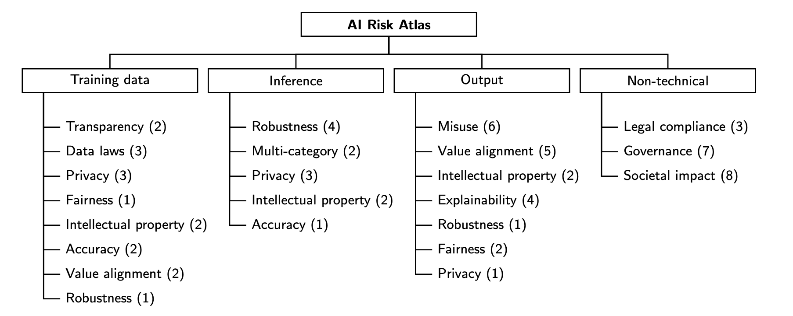

IBM AI Risk Atlas is a structured taxonomy that consolidates AI risks from diverse sources and aligns them with governance
frameworks.

The IBM AI Risk Atlas is a taxonomy of AI risks collected from prior research, real-world examples, and from experts in the field. It defines risks posed by AI systems and explain potential consequences of those risks. Each risk is grouped into one of four categories based on where the risk originates. The categories are input risks, inference risks, output risks and non-technical risks. Within each category, risks are further grouped into risk dimensions such as accuracy, fairness, or explainability. These dimensions classify the individual risks into groups, and enable a user of the Atlas to focus on the dimensions relevant to them.

## Find out more
- [IBM's AI Risk Atlas](https://www.ibm.com/docs/en/watsonx/saas?topic=ai-risk-atlas)
- Read the the IBM AI Ethics Board publication [Foundation models: Opportunities, risks and mitigations](https://www.ibm.com/downloads/documents/us-en/10a99803d8afd656) which goes into more detail about the risk taxonomy, and describes the point of view of IBM on the ethics of foundation models.
