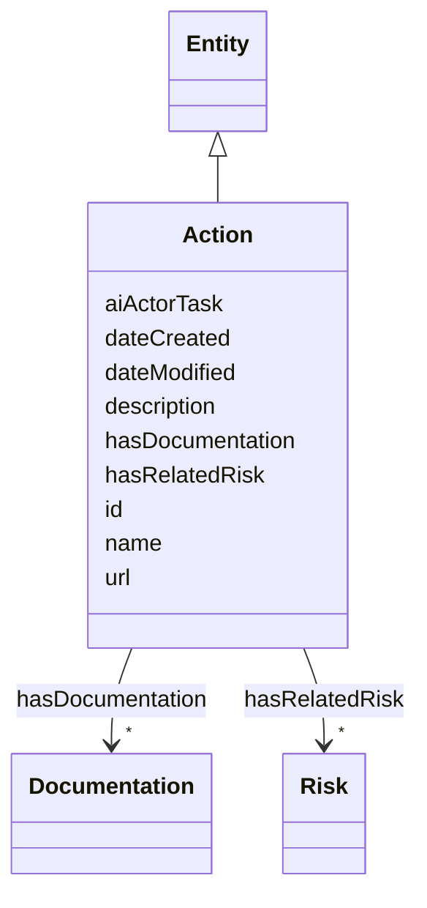

# Class: Action


_Action to remediate a risk_


URI: [nexus:Action](http://research.ibm.com/ontologies/aiont/Action)





## Inheritance
* [Entity](Entity.md)
    * **Action**


## Slots

| Name | Cardinality and Range | Description | Inheritance |
| ---  | --- | --- | --- |
| [hasRelatedRisk](hasRelatedRisk.md) | * <br/> [Risk](Risk.md) | A relationship where an entity relates to a risk | direct |
| [hasDocumentation](hasDocumentation.md) | * <br/> [Documentation](Documentation.md) | Indicates documentation associated with an entity | direct |
| [aiActorTask](aiActorTask.md) | * <br/> [String](String.md) | Pertinent AI Actor Tasks for each subcategory | direct |
| [id](id.md) | 1 <br/> [String](String.md) | A unique identifier to this instance of the model element | [Entity](Entity.md) |
| [name](name.md) | 0..1 <br/> [String](String.md) | A text name of this instance | [Entity](Entity.md) |
| [description](description.md) | 0..1 <br/> [String](String.md) | The description of an entity | [Entity](Entity.md) |
| [url](url.md) | 0..1 <br/> [Uri](Uri.md) | An optional URL associated with this instance | [Entity](Entity.md) |
| [dateCreated](dateCreated.md) | 0..1 <br/> [Date](Date.md) | The date on which the entity was created | [Entity](Entity.md) |
| [dateModified](dateModified.md) | 0..1 <br/> [Date](Date.md) | The date on which the entity was most recently modified | [Entity](Entity.md) |


## Usages

| used by | used in | type | used |
| ---  | --- | --- | --- |
| [Container](Container.md) | [actions](actions.md) | range | [Action](Action.md) |
| [Risk](Risk.md) | [hasRelatedAction](hasRelatedAction.md) | range | [Action](Action.md) |


## Identifier and Mapping Information


### Schema Source


* from schema: http://research.ibm.com/ontologies/aiont/ai-risk-ontology


## Mappings

| Mapping Type | Mapped Value |
| ---  | ---  |
| self | nexus:Action |
| native | nexus:Action |


## LinkML Source

<!-- TODO: investigate https://stackoverflow.com/questions/37606292/how-to-create-tabbed-code-blocks-in-mkdocs-or-sphinx -->

### Direct

<details>
```yaml
name: Action
description: Action to remediate a risk
from_schema: http://research.ibm.com/ontologies/aiont/ai-risk-ontology
is_a: Entity
slots:
- hasRelatedRisk
- hasDocumentation
attributes:
  aiActorTask:
    name: aiActorTask
    description: Pertinent AI Actor Tasks for each subcategory. Not every AI Actor
      Task listed will apply to every suggested action in the subcategory (i.e., some
      apply to AI development and others apply to AI deployment).
    from_schema: http://research.ibm.com/ontologies/aiont/ai_risk
    rank: 1000
    domain_of:
    - Action
    multivalued: true

```
</details>

### Induced

<details>
```yaml
name: Action
description: Action to remediate a risk
from_schema: http://research.ibm.com/ontologies/aiont/ai-risk-ontology
is_a: Entity
attributes:
  aiActorTask:
    name: aiActorTask
    description: Pertinent AI Actor Tasks for each subcategory. Not every AI Actor
      Task listed will apply to every suggested action in the subcategory (i.e., some
      apply to AI development and others apply to AI deployment).
    from_schema: http://research.ibm.com/ontologies/aiont/ai_risk
    rank: 1000
    alias: aiActorTask
    owner: Action
    domain_of:
    - Action
    range: string
    multivalued: true
  hasRelatedRisk:
    name: hasRelatedRisk
    description: A relationship where an entity relates to a risk
    from_schema: http://research.ibm.com/ontologies/aiont/ai-risk-ontology
    rank: 1000
    alias: hasRelatedRisk
    owner: Action
    domain_of:
    - Action
    - AiEval
    range: Risk
    multivalued: true
    inlined: false
  hasDocumentation:
    name: hasDocumentation
    description: Indicates documentation associated with an entity.
    from_schema: http://research.ibm.com/ontologies/aiont/ai-risk-ontology
    rank: 1000
    slot_uri: airo:hasDocumentation
    alias: hasDocumentation
    owner: Action
    domain_of:
    - Dataset
    - RiskTaxonomy
    - Action
    - AiEval
    - BaseAi
    - LargeLanguageModelFamily
    range: Documentation
    multivalued: true
    inlined: false
  id:
    name: id
    description: A unique identifier to this instance of the model element. Example
      identifiers include UUID, URI, URN, etc.
    from_schema: http://research.ibm.com/ontologies/aiont/ai-risk-ontology
    rank: 1000
    slot_uri: schema:identifier
    identifier: true
    alias: id
    owner: Action
    domain_of:
    - Entity
    range: string
    required: true
  name:
    name: name
    description: A text name of this instance.
    from_schema: http://research.ibm.com/ontologies/aiont/ai-risk-ontology
    rank: 1000
    slot_uri: schema:name
    alias: name
    owner: Action
    domain_of:
    - Entity
    range: string
  description:
    name: description
    description: The description of an entity
    from_schema: http://research.ibm.com/ontologies/aiont/ai-risk-ontology
    rank: 1000
    slot_uri: schema:description
    alias: description
    owner: Action
    domain_of:
    - Entity
    range: string
  url:
    name: url
    description: An optional URL associated with this instance.
    from_schema: http://research.ibm.com/ontologies/aiont/ai-risk-ontology
    rank: 1000
    slot_uri: schema:url
    alias: url
    owner: Action
    domain_of:
    - Entity
    range: uri
  dateCreated:
    name: dateCreated
    description: The date on which the entity was created.
    from_schema: http://research.ibm.com/ontologies/aiont/ai-risk-ontology
    rank: 1000
    slot_uri: schema:dateCreated
    alias: dateCreated
    owner: Action
    domain_of:
    - Entity
    range: date
    required: false
  dateModified:
    name: dateModified
    description: The date on which the entity was most recently modified.
    from_schema: http://research.ibm.com/ontologies/aiont/ai-risk-ontology
    rank: 1000
    slot_uri: schema:dateModified
    alias: dateModified
    owner: Action
    domain_of:
    - Entity
    range: date
    required: false

```
</details>