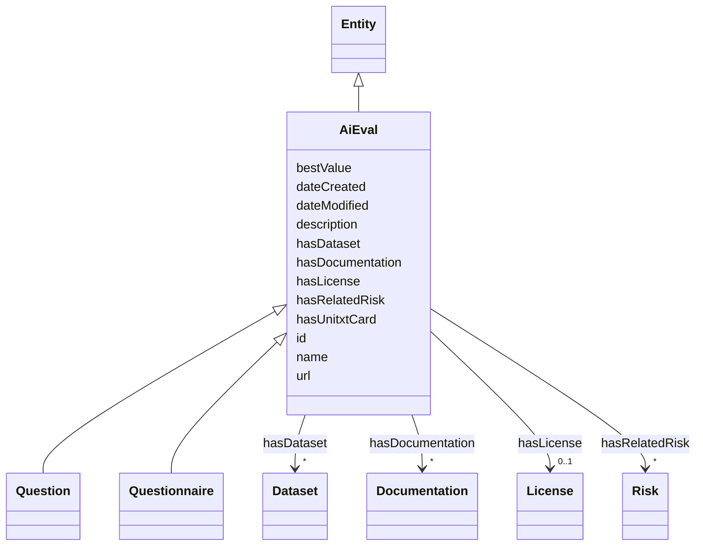

# Class: AiEval


_An AI Evaluation, e.g. a metric, benchmark, unitxt card evaluation, a question or a combination of such entities._


URI: [dqv:Metric](https://www.w3.org/TR/vocab-dqv/Metric)





## Inheritance
* [Entity](Entity.md)
    * **AiEval**
        * [Question](Question.md)
        * [Questionnaire](Questionnaire.md)


## Slots

| Name | Cardinality and Range | Description | Inheritance |
| ---  | --- | --- | --- |
| [hasDocumentation](hasDocumentation.md) | * <br/> [Documentation](Documentation.md) | Indicates documentation associated with an entity | direct |
| [hasDataset](hasDataset.md) | * <br/> [Dataset](Dataset.md) | A relationship to datasets that are used | direct |
| [hasUnitxtCard](hasUnitxtCard.md) | 0..1 <br/> [Uri](Uri.md) | A relationship to a Unitxt card defining the risk evaluation | direct |
| [hasLicense](hasLicense.md) | 0..1 <br/> [License](License.md) | Indicates licenses associated with a resource | direct |
| [hasRelatedRisk](hasRelatedRisk.md) | * <br/> [Risk](Risk.md) | A relationship where an entity relates to a risk | direct |
| [bestValue](bestValue.md) | 0..1 <br/> [String](String.md) | Annotation of the best possible result of the evaluation | direct |
| [id](id.md) | 1 <br/> [String](String.md) | A unique identifier to this instance of the model element | [Entity](Entity.md) |
| [name](name.md) | 0..1 <br/> [String](String.md) | A text name of this instance | [Entity](Entity.md) |
| [description](description.md) | 0..1 <br/> [String](String.md) | The description of an entity | [Entity](Entity.md) |
| [url](url.md) | 0..1 <br/> [Uri](Uri.md) | An optional URL associated with this instance | [Entity](Entity.md) |
| [dateCreated](dateCreated.md) | 0..1 <br/> [Date](Date.md) | The date on which the entity was created | [Entity](Entity.md) |
| [dateModified](dateModified.md) | 0..1 <br/> [Date](Date.md) | The date on which the entity was most recently modified | [Entity](Entity.md) |


## Usages

| used by | used in | type | used |
| ---  | --- | --- | --- |
| [Container](Container.md) | [evaluations](evaluations.md) | range | [AiEval](AiEval.md) |
| [AiEvalResult](AiEvalResult.md) | [isResultOf](isResultOf.md) | range | [AiEval](AiEval.md) |


## Identifier and Mapping Information


### Schema Source


* from schema: https://ibm.github.io/risk-atlas-nexus/ontology/ai-risk-ontology


## Mappings

| Mapping Type | Mapped Value |
| ---  | ---  |
| self | dqv:Metric |
| native | nexus:AiEval |


## LinkML Source

<!-- TODO: investigate https://stackoverflow.com/questions/37606292/how-to-create-tabbed-code-blocks-in-mkdocs-or-sphinx -->

### Direct

<details>
```yaml
name: AiEval
description: An AI Evaluation, e.g. a metric, benchmark, unitxt card evaluation, a
  question or a combination of such entities.
from_schema: https://ibm.github.io/risk-atlas-nexus/ontology/ai-risk-ontology
is_a: Entity
slots:
- hasDocumentation
- hasDataset
- hasUnitxtCard
- hasLicense
- hasRelatedRisk
- bestValue
slot_usage:
  isComposedOf:
    name: isComposedOf
    description: A relationship indicating that an AI evaluation maybe composed of
      other AI evaluations (e.g. it's an overall average of other scores).
    range: AiEval
class_uri: dqv:Metric

```
</details>

### Induced

<details>
```yaml
name: AiEval
description: An AI Evaluation, e.g. a metric, benchmark, unitxt card evaluation, a
  question or a combination of such entities.
from_schema: https://ibm.github.io/risk-atlas-nexus/ontology/ai-risk-ontology
is_a: Entity
slot_usage:
  isComposedOf:
    name: isComposedOf
    description: A relationship indicating that an AI evaluation maybe composed of
      other AI evaluations (e.g. it's an overall average of other scores).
    range: AiEval
attributes:
  hasDocumentation:
    name: hasDocumentation
    description: Indicates documentation associated with an entity.
    from_schema: https://ibm.github.io/risk-atlas-nexus/ontology/ai-risk-ontology
    rank: 1000
    slot_uri: airo:hasDocumentation
    alias: hasDocumentation
    owner: AiEval
    domain_of:
    - Dataset
    - RiskTaxonomy
    - Action
    - AiEval
    - BaseAi
    - LargeLanguageModelFamily
    range: Documentation
    multivalued: true
    inlined: false
  hasDataset:
    name: hasDataset
    description: A relationship to datasets that are used.
    from_schema: https://ibm.github.io/risk-atlas-nexus/ontology/ai-risk-ontology
    rank: 1000
    alias: hasDataset
    owner: AiEval
    domain_of:
    - AiEval
    range: Dataset
    multivalued: true
    inlined: false
  hasUnitxtCard:
    name: hasUnitxtCard
    description: A relationship to a Unitxt card defining the risk evaluation
    from_schema: https://ibm.github.io/risk-atlas-nexus/ontology/ai-risk-ontology
    rank: 1000
    slot_uri: schema:url
    alias: hasUnitxtCard
    owner: AiEval
    domain_of:
    - AiEval
    range: uri
  hasLicense:
    name: hasLicense
    description: Indicates licenses associated with a resource
    from_schema: https://ibm.github.io/risk-atlas-nexus/ontology/ai-risk-ontology
    rank: 1000
    slot_uri: airo:hasLicense
    alias: hasLicense
    owner: AiEval
    domain_of:
    - Dataset
    - RiskTaxonomy
    - AiEval
    - BaseAi
    range: License
  hasRelatedRisk:
    name: hasRelatedRisk
    description: A relationship where an entity relates to a risk
    from_schema: https://ibm.github.io/risk-atlas-nexus/ontology/ai-risk-ontology
    rank: 1000
    domain: RiskConcept
    alias: hasRelatedRisk
    owner: AiEval
    domain_of:
    - Action
    - AiEval
    range: Risk
    multivalued: true
    inlined: false
  bestValue:
    name: bestValue
    description: Annotation of the best possible result of the evaluation
    from_schema: https://ibm.github.io/risk-atlas-nexus/ontology/ai-risk-ontology
    rank: 1000
    alias: bestValue
    owner: AiEval
    domain_of:
    - AiEval
    range: string
  id:
    name: id
    description: A unique identifier to this instance of the model element. Example
      identifiers include UUID, URI, URN, etc.
    from_schema: https://ibm.github.io/risk-atlas-nexus/ontology/ai-risk-ontology
    rank: 1000
    slot_uri: schema:identifier
    identifier: true
    alias: id
    owner: AiEval
    domain_of:
    - Entity
    range: string
    required: true
  name:
    name: name
    description: A text name of this instance.
    from_schema: https://ibm.github.io/risk-atlas-nexus/ontology/ai-risk-ontology
    rank: 1000
    slot_uri: schema:name
    alias: name
    owner: AiEval
    domain_of:
    - Entity
    range: string
  description:
    name: description
    description: The description of an entity
    from_schema: https://ibm.github.io/risk-atlas-nexus/ontology/ai-risk-ontology
    rank: 1000
    slot_uri: schema:description
    alias: description
    owner: AiEval
    domain_of:
    - Entity
    range: string
  url:
    name: url
    description: An optional URL associated with this instance.
    from_schema: https://ibm.github.io/risk-atlas-nexus/ontology/ai-risk-ontology
    rank: 1000
    slot_uri: schema:url
    alias: url
    owner: AiEval
    domain_of:
    - Entity
    range: uri
  dateCreated:
    name: dateCreated
    description: The date on which the entity was created.
    from_schema: https://ibm.github.io/risk-atlas-nexus/ontology/ai-risk-ontology
    rank: 1000
    slot_uri: schema:dateCreated
    alias: dateCreated
    owner: AiEval
    domain_of:
    - Entity
    range: date
    required: false
  dateModified:
    name: dateModified
    description: The date on which the entity was most recently modified.
    from_schema: https://ibm.github.io/risk-atlas-nexus/ontology/ai-risk-ontology
    rank: 1000
    slot_uri: schema:dateModified
    alias: dateModified
    owner: AiEval
    domain_of:
    - Entity
    range: date
    required: false
class_uri: dqv:Metric

```
</details>