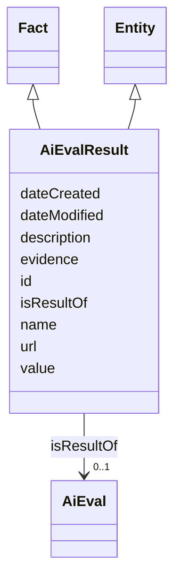

# Class: AiEvalResult


_The result of an evaluation for a specific AI model._


URI: [dqv:QualityMeasurement](https://www.w3.org/TR/vocab-dqv/QualityMeasurement)





## Inheritance
* [Entity](Entity.md)
    * **AiEvalResult** [ [Fact](Fact.md)]


## Slots

| Name | Cardinality and Range | Description | Inheritance |
| ---  | --- | --- | --- |
| [isResultOf](isResultOf.md) | 0..1 <br/> [AiEval](AiEval.md) | A relationship indicating that an entity is the result of an AI evaluation | direct |
| [value](value.md) | 1 <br/> [String](String.md) | Some numeric or string value | [Fact](Fact.md) |
| [evidence](evidence.md) | 0..1 <br/> [String](String.md) | Evidence provides a source (typical a chunk, paragraph or link) describing wh... | [Fact](Fact.md) |
| [id](id.md) | 1 <br/> [String](String.md) | A unique identifier to this instance of the model element | [Entity](Entity.md) |
| [name](name.md) | 0..1 <br/> [String](String.md) | A text name of this instance | [Entity](Entity.md) |
| [description](description.md) | 0..1 <br/> [String](String.md) | The description of an entity | [Entity](Entity.md) |
| [url](url.md) | 0..1 <br/> [Uri](Uri.md) | An optional URL associated with this instance | [Entity](Entity.md) |
| [dateCreated](dateCreated.md) | 0..1 <br/> [Date](Date.md) | The date on which the entity was created | [Entity](Entity.md) |
| [dateModified](dateModified.md) | 0..1 <br/> [Date](Date.md) | The date on which the entity was most recently modified | [Entity](Entity.md) |


## Usages

| used by | used in | type | used |
| ---  | --- | --- | --- |
| [AiModel](AiModel.md) | [hasEvaluation](hasEvaluation.md) | range | [AiEvalResult](AiEvalResult.md) |
| [LargeLanguageModel](LargeLanguageModel.md) | [hasEvaluation](hasEvaluation.md) | range | [AiEvalResult](AiEvalResult.md) |


## Identifier and Mapping Information


### Schema Source


* from schema: https://ibm.github.io/risk-atlas-nexus/ontology/ai-risk-ontology


## Mappings

| Mapping Type | Mapped Value |
| ---  | ---  |
| self | dqv:QualityMeasurement |
| native | nexus:AiEvalResult |


## LinkML Source

<!-- TODO: investigate https://stackoverflow.com/questions/37606292/how-to-create-tabbed-code-blocks-in-mkdocs-or-sphinx -->

### Direct

<details>
```yaml
name: AiEvalResult
description: The result of an evaluation for a specific AI model.
from_schema: https://ibm.github.io/risk-atlas-nexus/ontology/ai-risk-ontology
is_a: Entity
mixins:
- Fact
slots:
- isResultOf
class_uri: dqv:QualityMeasurement

```
</details>

### Induced

<details>
```yaml
name: AiEvalResult
description: The result of an evaluation for a specific AI model.
from_schema: https://ibm.github.io/risk-atlas-nexus/ontology/ai-risk-ontology
is_a: Entity
mixins:
- Fact
attributes:
  isResultOf:
    name: isResultOf
    description: A relationship indicating that an entity is the result of an AI evaluation.
    from_schema: https://ibm.github.io/risk-atlas-nexus/ontology/ai-risk-ontology
    rank: 1000
    slot_uri: dqv:isMeasurementOf
    alias: isResultOf
    owner: AiEvalResult
    domain_of:
    - AiEvalResult
    range: AiEval
    inlined: false
  value:
    name: value
    description: Some numeric or string value
    from_schema: https://ibm.github.io/risk-atlas-nexus/ontology/ai-risk-ontology
    rank: 1000
    alias: value
    owner: AiEvalResult
    domain_of:
    - Fact
    range: string
    required: true
  evidence:
    name: evidence
    description: Evidence provides a source (typical a chunk, paragraph or link) describing
      where some value was found or how it was generated.
    from_schema: https://ibm.github.io/risk-atlas-nexus/ontology/ai-risk-ontology
    rank: 1000
    alias: evidence
    owner: AiEvalResult
    domain_of:
    - Fact
    range: string
  id:
    name: id
    description: A unique identifier to this instance of the model element. Example
      identifiers include UUID, URI, URN, etc.
    from_schema: https://ibm.github.io/risk-atlas-nexus/ontology/ai-risk-ontology
    rank: 1000
    slot_uri: schema:identifier
    identifier: true
    alias: id
    owner: AiEvalResult
    domain_of:
    - Entity
    range: string
    required: true
  name:
    name: name
    description: A text name of this instance.
    from_schema: https://ibm.github.io/risk-atlas-nexus/ontology/ai-risk-ontology
    rank: 1000
    slot_uri: schema:name
    alias: name
    owner: AiEvalResult
    domain_of:
    - Entity
    range: string
  description:
    name: description
    description: The description of an entity
    from_schema: https://ibm.github.io/risk-atlas-nexus/ontology/ai-risk-ontology
    rank: 1000
    slot_uri: schema:description
    alias: description
    owner: AiEvalResult
    domain_of:
    - Entity
    range: string
  url:
    name: url
    description: An optional URL associated with this instance.
    from_schema: https://ibm.github.io/risk-atlas-nexus/ontology/ai-risk-ontology
    rank: 1000
    slot_uri: schema:url
    alias: url
    owner: AiEvalResult
    domain_of:
    - Entity
    range: uri
  dateCreated:
    name: dateCreated
    description: The date on which the entity was created.
    from_schema: https://ibm.github.io/risk-atlas-nexus/ontology/ai-risk-ontology
    rank: 1000
    slot_uri: schema:dateCreated
    alias: dateCreated
    owner: AiEvalResult
    domain_of:
    - Entity
    range: date
    required: false
  dateModified:
    name: dateModified
    description: The date on which the entity was most recently modified.
    from_schema: https://ibm.github.io/risk-atlas-nexus/ontology/ai-risk-ontology
    rank: 1000
    slot_uri: schema:dateModified
    alias: dateModified
    owner: AiEvalResult
    domain_of:
    - Entity
    range: date
    required: false
class_uri: dqv:QualityMeasurement

```
</details>