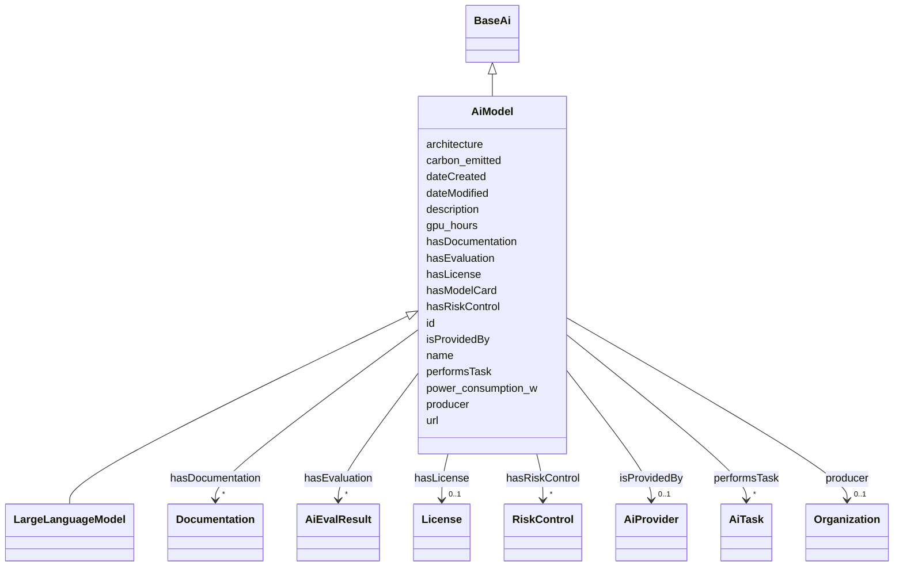

# Class: AiModel


_A base AI Model class. No assumption about the type (SVM, LLM, etc.). Subclassed by model types (see LargeLanguageModel)._


URI: [nexus:AiModel](https://ibm.github.io/risk-atlas-nexus/ontology/AiModel)





## Inheritance
* [Entity](Entity.md)
    * [BaseAi](BaseAi.md)
        * **AiModel**
            * [LargeLanguageModel](LargeLanguageModel.md)


## Slots

| Name | Cardinality and Range | Description | Inheritance |
| ---  | --- | --- | --- |
| [hasEvaluation](hasEvaluation.md) | * <br/> [AiEvalResult](AiEvalResult.md) | A relationship indicating that an entity has an AI evaluation result | direct |
| [architecture](architecture.md) | 0..1 <br/> [String](String.md) | A description of the architecture of an AI such as 'Decoder-only' | direct |
| [gpu_hours](gpu_hours.md) | 0..1 <br/> [Integer](Integer.md) | GPU consumption in terms of hours | direct |
| [power_consumption_w](power_consumption_w.md) | 0..1 <br/> [Integer](Integer.md) | power consumption in Watts | direct |
| [carbon_emitted](carbon_emitted.md) | 0..1 <br/> [Float](Float.md) | The number of tons of carbon dioxide equivalent that are emitted during train... | direct |
| [hasRiskControl](hasRiskControl.md) | * <br/> [RiskControl](RiskControl.md) | Indicates the control measures associated with a system or component to modif... | direct |
| [producer](producer.md) | 0..1 <br/> [Organization](Organization.md) | A relationship to the Organization instance which produces this instance | [BaseAi](BaseAi.md) |
| [hasModelCard](hasModelCard.md) | * <br/> [String](String.md) | A relationship to model card references | [BaseAi](BaseAi.md) |
| [hasDocumentation](hasDocumentation.md) | * <br/> [Documentation](Documentation.md) | Indicates documentation associated with an entity | [BaseAi](BaseAi.md) |
| [hasLicense](hasLicense.md) | 0..1 <br/> [License](License.md) | Indicates licenses associated with a resource | [BaseAi](BaseAi.md) |
| [performsTask](performsTask.md) | * <br/> [AiTask](AiTask.md) | relationship indicating the AI tasks an AI model can perform | [BaseAi](BaseAi.md) |
| [isProvidedBy](isProvidedBy.md) | 0..1 <br/> [AiProvider](AiProvider.md) | A relationship indicating the AI model has been provided by an AI model provi... | [BaseAi](BaseAi.md) |
| [id](id.md) | 1 <br/> [String](String.md) | A unique identifier to this instance of the model element | [Entity](Entity.md) |
| [name](name.md) | 0..1 <br/> [String](String.md) | A text name of this instance | [Entity](Entity.md) |
| [description](description.md) | 0..1 <br/> [String](String.md) | The description of an entity | [Entity](Entity.md) |
| [url](url.md) | 0..1 <br/> [Uri](Uri.md) | An optional URL associated with this instance | [Entity](Entity.md) |
| [dateCreated](dateCreated.md) | 0..1 <br/> [Date](Date.md) | The date on which the entity was created | [Entity](Entity.md) |
| [dateModified](dateModified.md) | 0..1 <br/> [Date](Date.md) | The date on which the entity was most recently modified | [Entity](Entity.md) |


## Identifier and Mapping Information


### Schema Source


* from schema: https://ibm.github.io/risk-atlas-nexus/ontology/ai-risk-ontology


## Mappings

| Mapping Type | Mapped Value |
| ---  | ---  |
| self | nexus:AiModel |
| native | nexus:AiModel |


## LinkML Source

<!-- TODO: investigate https://stackoverflow.com/questions/37606292/how-to-create-tabbed-code-blocks-in-mkdocs-or-sphinx -->

### Direct

<details>
```yaml
name: AiModel
description: A base AI Model class. No assumption about the type (SVM, LLM, etc.).
  Subclassed by model types (see LargeLanguageModel).
from_schema: https://ibm.github.io/risk-atlas-nexus/ontology/ai-risk-ontology
is_a: BaseAi
slots:
- hasEvaluation
- architecture
- gpu_hours
- power_consumption_w
- carbon_emitted
- hasRiskControl

```
</details>

### Induced

<details>
```yaml
name: AiModel
description: A base AI Model class. No assumption about the type (SVM, LLM, etc.).
  Subclassed by model types (see LargeLanguageModel).
from_schema: https://ibm.github.io/risk-atlas-nexus/ontology/ai-risk-ontology
is_a: BaseAi
attributes:
  hasEvaluation:
    name: hasEvaluation
    description: A relationship indicating that an entity has an AI evaluation result.
    from_schema: https://ibm.github.io/risk-atlas-nexus/ontology/ai-risk-ontology
    rank: 1000
    slot_uri: dqv:hasQualityMeasurement
    alias: hasEvaluation
    owner: AiModel
    domain_of:
    - AiModel
    range: AiEvalResult
    multivalued: true
    inlined: true
    inlined_as_list: true
  architecture:
    name: architecture
    description: A description of the architecture of an AI such as 'Decoder-only'.
    from_schema: https://ibm.github.io/risk-atlas-nexus/ontology/ai-risk-ontology
    rank: 1000
    alias: architecture
    owner: AiModel
    domain_of:
    - AiModel
    range: string
  gpu_hours:
    name: gpu_hours
    description: GPU consumption in terms of hours
    from_schema: https://ibm.github.io/risk-atlas-nexus/ontology/ai-risk-ontology
    rank: 1000
    alias: gpu_hours
    owner: AiModel
    domain_of:
    - AiModel
    range: integer
    minimum_value: 0
  power_consumption_w:
    name: power_consumption_w
    description: power consumption in Watts
    from_schema: https://ibm.github.io/risk-atlas-nexus/ontology/ai-risk-ontology
    rank: 1000
    alias: power_consumption_w
    owner: AiModel
    domain_of:
    - AiModel
    range: integer
    minimum_value: 0
  carbon_emitted:
    name: carbon_emitted
    description: The number of tons of carbon dioxide equivalent that are emitted
      during training
    from_schema: https://ibm.github.io/risk-atlas-nexus/ontology/ai-risk-ontology
    rank: 1000
    alias: carbon_emitted
    owner: AiModel
    domain_of:
    - AiModel
    range: float
    minimum_value: 0
    unit:
      symbol: t CO2-eq
      descriptive_name: tons of CO2 equivalent
  hasRiskControl:
    name: hasRiskControl
    description: Indicates the control measures associated with a system or component
      to modify risks.
    from_schema: https://ibm.github.io/risk-atlas-nexus/ontology/ai-risk-ontology
    rank: 1000
    slot_uri: airo:hasRiskControl
    alias: hasRiskControl
    owner: AiModel
    domain_of:
    - AiModel
    range: RiskControl
    multivalued: true
  producer:
    name: producer
    description: A relationship to the Organization instance which produces this instance.
    from_schema: https://ibm.github.io/risk-atlas-nexus/ontology/ai-risk-ontology
    rank: 1000
    alias: producer
    owner: AiModel
    domain_of:
    - BaseAi
    range: Organization
  hasModelCard:
    name: hasModelCard
    description: A relationship to model card references.
    from_schema: https://ibm.github.io/risk-atlas-nexus/ontology/ai-risk-ontology
    rank: 1000
    alias: hasModelCard
    owner: AiModel
    domain_of:
    - BaseAi
    range: string
    multivalued: true
    inlined: true
    inlined_as_list: true
  hasDocumentation:
    name: hasDocumentation
    description: Indicates documentation associated with an entity.
    from_schema: https://ibm.github.io/risk-atlas-nexus/ontology/ai-risk-ontology
    rank: 1000
    slot_uri: airo:hasDocumentation
    alias: hasDocumentation
    owner: AiModel
    domain_of:
    - Dataset
    - RiskTaxonomy
    - Action
    - AiEval
    - BaseAi
    - LargeLanguageModelFamily
    range: Documentation
    multivalued: true
    inlined: false
  hasLicense:
    name: hasLicense
    description: Indicates licenses associated with a resource
    from_schema: https://ibm.github.io/risk-atlas-nexus/ontology/ai-risk-ontology
    rank: 1000
    slot_uri: airo:hasLicense
    alias: hasLicense
    owner: AiModel
    domain_of:
    - Dataset
    - RiskTaxonomy
    - AiEval
    - BaseAi
    range: License
  performsTask:
    name: performsTask
    description: relationship indicating the AI tasks an AI model can perform.
    from_schema: https://ibm.github.io/risk-atlas-nexus/ontology/ai-risk-ontology
    rank: 1000
    alias: performsTask
    owner: AiModel
    domain_of:
    - BaseAi
    range: AiTask
    multivalued: true
    inlined: false
  isProvidedBy:
    name: isProvidedBy
    description: A relationship indicating the AI model has been provided by an AI
      model provider.
    from_schema: https://ibm.github.io/risk-atlas-nexus/ontology/ai-risk-ontology
    rank: 1000
    slot_uri: airo:isProvidedBy
    alias: isProvidedBy
    owner: AiModel
    domain_of:
    - BaseAi
    range: AiProvider
  id:
    name: id
    description: A unique identifier to this instance of the model element. Example
      identifiers include UUID, URI, URN, etc.
    from_schema: https://ibm.github.io/risk-atlas-nexus/ontology/ai-risk-ontology
    rank: 1000
    slot_uri: schema:identifier
    identifier: true
    alias: id
    owner: AiModel
    domain_of:
    - Entity
    range: string
    required: true
  name:
    name: name
    description: A text name of this instance.
    from_schema: https://ibm.github.io/risk-atlas-nexus/ontology/ai-risk-ontology
    rank: 1000
    slot_uri: schema:name
    alias: name
    owner: AiModel
    domain_of:
    - Entity
    range: string
  description:
    name: description
    description: The description of an entity
    from_schema: https://ibm.github.io/risk-atlas-nexus/ontology/ai-risk-ontology
    rank: 1000
    slot_uri: schema:description
    alias: description
    owner: AiModel
    domain_of:
    - Entity
    range: string
  url:
    name: url
    description: An optional URL associated with this instance.
    from_schema: https://ibm.github.io/risk-atlas-nexus/ontology/ai-risk-ontology
    rank: 1000
    slot_uri: schema:url
    alias: url
    owner: AiModel
    domain_of:
    - Entity
    range: uri
  dateCreated:
    name: dateCreated
    description: The date on which the entity was created.
    from_schema: https://ibm.github.io/risk-atlas-nexus/ontology/ai-risk-ontology
    rank: 1000
    slot_uri: schema:dateCreated
    alias: dateCreated
    owner: AiModel
    domain_of:
    - Entity
    range: date
    required: false
  dateModified:
    name: dateModified
    description: The date on which the entity was most recently modified.
    from_schema: https://ibm.github.io/risk-atlas-nexus/ontology/ai-risk-ontology
    rank: 1000
    slot_uri: schema:dateModified
    alias: dateModified
    owner: AiModel
    domain_of:
    - Entity
    range: date
    required: false

```
</details>