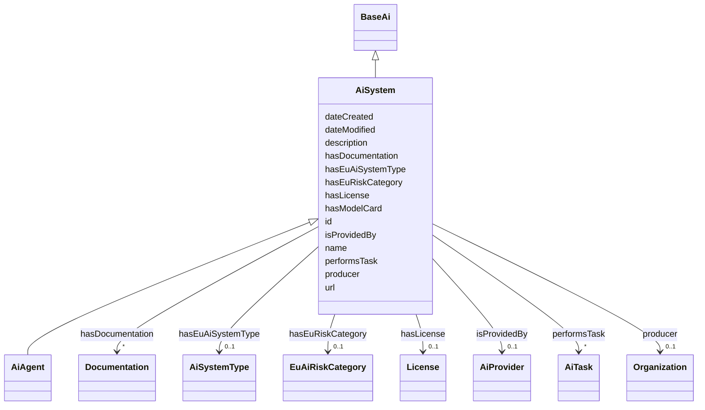

# Class: AiSystem


_A compound AI System composed of one or more AI capablities. ChatGPT is an example of an AI system which deploys multiple GPT AI models._


URI: [airo:AISystem](https://w3id.org/airo#AISystem)





## Inheritance
* [Entity](Entity.md)
    * [BaseAi](BaseAi.md)
        * **AiSystem**
            * [AiAgent](AiAgent.md)


## Slots

| Name | Cardinality and Range | Description | Inheritance |
| ---  | --- | --- | --- |
| [hasEuAiSystemType](hasEuAiSystemType.md) | 0..1 <br/> [AiSystemType](AiSystemType.md) | The type of system as defined by the EU AI Act | direct |
| [hasEuRiskCategory](hasEuRiskCategory.md) | 0..1 <br/> [EuAiRiskCategory](EuAiRiskCategory.md) | The risk category of an AI system as defined by the EU AI Act | direct |
| [producer](producer.md) | 0..1 <br/> [Organization](Organization.md) | A relationship to the Organization instance which produces this instance | [BaseAi](BaseAi.md) |
| [hasModelCard](hasModelCard.md) | * <br/> [String](String.md) | A relationship to model card references | [BaseAi](BaseAi.md) |
| [hasDocumentation](hasDocumentation.md) | * <br/> [Documentation](Documentation.md) | Indicates documentation associated with an entity | [BaseAi](BaseAi.md) |
| [hasLicense](hasLicense.md) | 0..1 <br/> [License](License.md) | Indicates licenses associated with a resource | [BaseAi](BaseAi.md) |
| [performsTask](performsTask.md) | * <br/> [AiTask](AiTask.md) | relationship indicating the AI tasks an AI model can perform | [BaseAi](BaseAi.md) |
| [isProvidedBy](isProvidedBy.md) | 0..1 <br/> [AiProvider](AiProvider.md) | A relationship indicating the AI model has been provided by an AI model provi... | [BaseAi](BaseAi.md) |
| [id](id.md) | 1 <br/> [String](String.md) | A unique identifier to this instance of the model element | [Entity](Entity.md) |
| [name](name.md) | 0..1 <br/> [String](String.md) | A text name of this instance | [Entity](Entity.md) |
| [description](description.md) | 0..1 <br/> [String](String.md) | The description of an entity | [Entity](Entity.md) |
| [url](url.md) | 0..1 <br/> [Uri](Uri.md) | An optional URL associated with this instance | [Entity](Entity.md) |
| [dateCreated](dateCreated.md) | 0..1 <br/> [Date](Date.md) | The date on which the entity was created | [Entity](Entity.md) |
| [dateModified](dateModified.md) | 0..1 <br/> [Date](Date.md) | The date on which the entity was most recently modified | [Entity](Entity.md) |


## Identifier and Mapping Information


### Schema Source


* from schema: https://ibm.github.io/risk-atlas-nexus/ontology/ai-risk-ontology


## Mappings

| Mapping Type | Mapped Value |
| ---  | ---  |
| self | airo:AISystem |
| native | nexus:AiSystem |


## LinkML Source

<!-- TODO: investigate https://stackoverflow.com/questions/37606292/how-to-create-tabbed-code-blocks-in-mkdocs-or-sphinx -->

### Direct

<details>
```yaml
name: AiSystem
description: A compound AI System composed of one or more AI capablities. ChatGPT
  is an example of an AI system which deploys multiple GPT AI models.
from_schema: https://ibm.github.io/risk-atlas-nexus/ontology/ai-risk-ontology
is_a: BaseAi
slots:
- hasEuAiSystemType
- hasEuRiskCategory
slot_usage:
  isComposedOf:
    name: isComposedOf
    description: Relationship indicating the AI components from which a complete AI
      system is composed.
    range: BaseAi
class_uri: airo:AISystem

```
</details>

### Induced

<details>
```yaml
name: AiSystem
description: A compound AI System composed of one or more AI capablities. ChatGPT
  is an example of an AI system which deploys multiple GPT AI models.
from_schema: https://ibm.github.io/risk-atlas-nexus/ontology/ai-risk-ontology
is_a: BaseAi
slot_usage:
  isComposedOf:
    name: isComposedOf
    description: Relationship indicating the AI components from which a complete AI
      system is composed.
    range: BaseAi
attributes:
  hasEuAiSystemType:
    name: hasEuAiSystemType
    description: The type of system as defined by the EU AI Act.
    from_schema: https://ibm.github.io/risk-atlas-nexus/ontology/ai-risk-ontology
    rank: 1000
    alias: hasEuAiSystemType
    owner: AiSystem
    domain_of:
    - AiSystem
    range: AiSystemType
  hasEuRiskCategory:
    name: hasEuRiskCategory
    description: The risk category of an AI system as defined by the EU AI Act.
    from_schema: https://ibm.github.io/risk-atlas-nexus/ontology/ai-risk-ontology
    rank: 1000
    alias: hasEuRiskCategory
    owner: AiSystem
    domain_of:
    - AiSystem
    range: EuAiRiskCategory
  producer:
    name: producer
    description: A relationship to the Organization instance which produces this instance.
    from_schema: https://ibm.github.io/risk-atlas-nexus/ontology/ai-risk-ontology
    rank: 1000
    alias: producer
    owner: AiSystem
    domain_of:
    - BaseAi
    range: Organization
  hasModelCard:
    name: hasModelCard
    description: A relationship to model card references.
    from_schema: https://ibm.github.io/risk-atlas-nexus/ontology/ai-risk-ontology
    rank: 1000
    alias: hasModelCard
    owner: AiSystem
    domain_of:
    - BaseAi
    range: string
    multivalued: true
    inlined: true
    inlined_as_list: true
  hasDocumentation:
    name: hasDocumentation
    description: Indicates documentation associated with an entity.
    from_schema: https://ibm.github.io/risk-atlas-nexus/ontology/ai-risk-ontology
    rank: 1000
    slot_uri: airo:hasDocumentation
    alias: hasDocumentation
    owner: AiSystem
    domain_of:
    - Dataset
    - RiskTaxonomy
    - Action
    - AiEval
    - BenchmarkMetadataCard
    - BaseAi
    - LargeLanguageModelFamily
    range: Documentation
    multivalued: true
    inlined: false
  hasLicense:
    name: hasLicense
    description: Indicates licenses associated with a resource
    from_schema: https://ibm.github.io/risk-atlas-nexus/ontology/ai-risk-ontology
    rank: 1000
    slot_uri: airo:hasLicense
    alias: hasLicense
    owner: AiSystem
    domain_of:
    - Dataset
    - Documentation
    - RiskTaxonomy
    - AiEval
    - BenchmarkMetadataCard
    - BaseAi
    range: License
  performsTask:
    name: performsTask
    description: relationship indicating the AI tasks an AI model can perform.
    from_schema: https://ibm.github.io/risk-atlas-nexus/ontology/ai-risk-ontology
    rank: 1000
    alias: performsTask
    owner: AiSystem
    domain_of:
    - BaseAi
    range: AiTask
    multivalued: true
    inlined: false
  isProvidedBy:
    name: isProvidedBy
    description: A relationship indicating the AI model has been provided by an AI
      model provider.
    from_schema: https://ibm.github.io/risk-atlas-nexus/ontology/ai-risk-ontology
    rank: 1000
    slot_uri: airo:isProvidedBy
    alias: isProvidedBy
    owner: AiSystem
    domain_of:
    - BaseAi
    range: AiProvider
  id:
    name: id
    description: A unique identifier to this instance of the model element. Example
      identifiers include UUID, URI, URN, etc.
    from_schema: https://ibm.github.io/risk-atlas-nexus/ontology/ai-risk-ontology
    rank: 1000
    slot_uri: schema:identifier
    identifier: true
    alias: id
    owner: AiSystem
    domain_of:
    - Entity
    range: string
    required: true
  name:
    name: name
    description: A text name of this instance.
    from_schema: https://ibm.github.io/risk-atlas-nexus/ontology/ai-risk-ontology
    rank: 1000
    slot_uri: schema:name
    alias: name
    owner: AiSystem
    domain_of:
    - Entity
    - BenchmarkMetadataCard
    range: string
  description:
    name: description
    description: The description of an entity
    from_schema: https://ibm.github.io/risk-atlas-nexus/ontology/ai-risk-ontology
    rank: 1000
    slot_uri: schema:description
    alias: description
    owner: AiSystem
    domain_of:
    - Entity
    range: string
  url:
    name: url
    description: An optional URL associated with this instance.
    from_schema: https://ibm.github.io/risk-atlas-nexus/ontology/ai-risk-ontology
    rank: 1000
    slot_uri: schema:url
    alias: url
    owner: AiSystem
    domain_of:
    - Entity
    range: uri
  dateCreated:
    name: dateCreated
    description: The date on which the entity was created.
    from_schema: https://ibm.github.io/risk-atlas-nexus/ontology/ai-risk-ontology
    rank: 1000
    slot_uri: schema:dateCreated
    alias: dateCreated
    owner: AiSystem
    domain_of:
    - Entity
    range: date
    required: false
  dateModified:
    name: dateModified
    description: The date on which the entity was most recently modified.
    from_schema: https://ibm.github.io/risk-atlas-nexus/ontology/ai-risk-ontology
    rank: 1000
    slot_uri: schema:dateModified
    alias: dateModified
    owner: AiSystem
    domain_of:
    - Entity
    range: date
    required: false
class_uri: airo:AISystem

```
</details>
