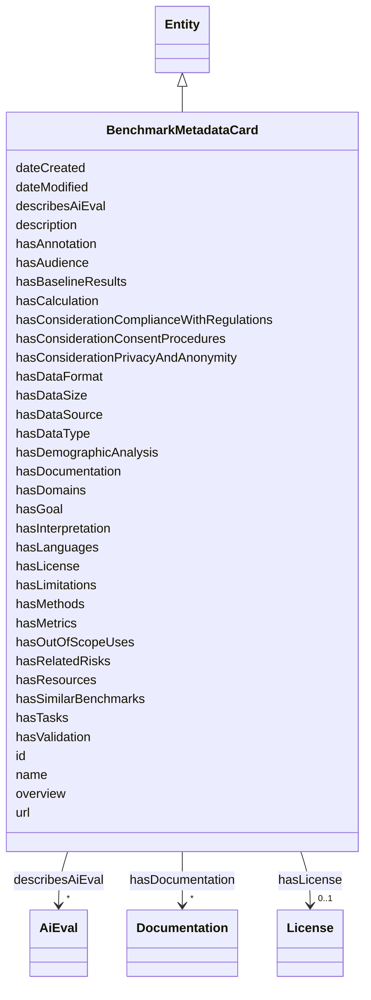

# Class: BenchmarkMetadataCard


_Benchmark metadata cards offer a standardized way to document LLM benchmarks clearly and transparently. Inspired by Model Cards and Datasheets, Benchmark metadata cards help researchers and practitioners understand exactly what benchmarks test, how they relate to real-world risks, and how to interpret their results responsibly.  This is an implementation of the design set out in 'BenchmarkCards: Large Language Model and Risk Reporting' (https://doi.org/10.48550/arXiv.2410.12974)_


URI: [nexus:benchmarkmetadatacard](https://ibm.github.io/risk-atlas-nexus/ontology/benchmarkmetadatacard)





## Inheritance
* [Entity](Entity.md)
    * **BenchmarkMetadataCard**


## Slots

| Name | Cardinality and Range | Description | Inheritance |
| ---  | --- | --- | --- |
| [describesAiEval](describesAiEval.md) | * <br/> [AiEval](AiEval.md) | A relationship where a BenchmarkMetadataCard describes and AI evaluation (ben... | direct |
| [hasDataType](hasDataType.md) | * <br/> [String](String.md) | The type of data used in the benchmark (e | direct |
| [hasDomains](hasDomains.md) | * <br/> [String](String.md) | The specific domains or areas where the benchmark is applied (e | direct |
| [hasLanguages](hasLanguages.md) | * <br/> [String](String.md) | The languages included in the dataset used by the benchmark (e | direct |
| [hasSimilarBenchmarks](hasSimilarBenchmarks.md) | * <br/> [String](String.md) | Benchmarks that are closely related in terms of goals or data type | direct |
| [hasResources](hasResources.md) | * <br/> [String](String.md) | Links to relevant resources, such as repositories or papers related to the be... | direct |
| [hasGoal](hasGoal.md) | 0..1 <br/> [String](String.md) | The specific goal or primary use case the benchmark is designed for | direct |
| [hasAudience](hasAudience.md) | 0..1 <br/> [String](String.md) | The intended audience, such as researchers, developers, policymakers, etc | direct |
| [hasTasks](hasTasks.md) | * <br/> [String](String.md) | The tasks or evaluations the benchmark is intended to assess | direct |
| [hasLimitations](hasLimitations.md) | * <br/> [String](String.md) | Limitations in evaluating or addressing risks, such as gaps in demographic co... | direct |
| [hasOutOfScopeUses](hasOutOfScopeUses.md) | * <br/> [String](String.md) | Use cases where the benchmark is not designed to be applied and could give mi... | direct |
| [hasDataSource](hasDataSource.md) | * <br/> [String](String.md) | The origin or source of the data used in the benchmark (e | direct |
| [hasDataSize](hasDataSize.md) | 0..1 <br/> [String](String.md) | The size of the dataset, including the number of data points or examples | direct |
| [hasDataFormat](hasDataFormat.md) | 0..1 <br/> [String](String.md) | The structure and modality of the data (e | direct |
| [hasAnnotation](hasAnnotation.md) | 0..1 <br/> [String](String.md) | The process used to annotate or label the dataset, including who or what perf... | direct |
| [hasMethods](hasMethods.md) | * <br/> [String](String.md) | The evaluation techniques applied within the benchmark | direct |
| [hasMetrics](hasMetrics.md) | * <br/> [String](String.md) | The specific performance metrics used to assess models (e | direct |
| [hasCalculation](hasCalculation.md) | * <br/> [String](String.md) | The way metrics are computed based on model outputs and the benchmark data | direct |
| [hasInterpretation](hasInterpretation.md) | * <br/> [String](String.md) | How users should interpret the scores or results from the metrics | direct |
| [hasBaselineResults](hasBaselineResults.md) | 0..1 <br/> [String](String.md) | The results of well-known or widely used models to give context to new perfor... | direct |
| [hasValidation](hasValidation.md) | * <br/> [String](String.md) | Measures taken to ensure that the benchmark provides valid and reliable evalu... | direct |
| [hasRelatedRisks](hasRelatedRisks.md) | * <br/> [String](String.md) | Specific risks of LLMs the benchmark assesses | direct |
| [hasDemographicAnalysis](hasDemographicAnalysis.md) | 0..1 <br/> [String](String.md) | How the benchmark evaluates performance across different demographic groups (... | direct |
| [hasConsiderationPrivacyAndAnonymity](hasConsiderationPrivacyAndAnonymity.md) | 0..1 <br/> [String](String.md) | How any personal or sensitive data is handled and whether any anonymization t... | direct |
| [hasLicense](hasLicense.md) | 0..1 <br/> [License](License.md) | Indicates licenses associated with a resource | direct |
| [hasConsiderationConsentProcedures](hasConsiderationConsentProcedures.md) | 0..1 <br/> [String](String.md) | Information on how consent was obtained (if applicable), especially for datas... | direct |
| [hasConsiderationComplianceWithRegulations](hasConsiderationComplianceWithRegulations.md) | 0..1 <br/> [String](String.md) | Compliance with relevant legal or ethical regulations (if applicable) | direct |
| [hasDocumentation](hasDocumentation.md) | * <br/> [Documentation](Documentation.md) | Indicates documentation associated with an entity | direct |
| [name](name.md) | 0..1 <br/> [String](String.md) | The official name of the benchmark | direct |
| [overview](overview.md) | 0..1 <br/> [String](String.md) | A brief description of the benchmark's main goals and scope | direct |
| [id](id.md) | 1 <br/> [String](String.md) | A unique identifier to this instance of the model element | [Entity](Entity.md) |
| [description](description.md) | 0..1 <br/> [String](String.md) | The description of an entity | [Entity](Entity.md) |
| [url](url.md) | 0..1 <br/> [Uri](Uri.md) | An optional URL associated with this instance | [Entity](Entity.md) |
| [dateCreated](dateCreated.md) | 0..1 <br/> [Date](Date.md) | The date on which the entity was created | [Entity](Entity.md) |
| [dateModified](dateModified.md) | 0..1 <br/> [Date](Date.md) | The date on which the entity was most recently modified | [Entity](Entity.md) |


## Usages

| used by | used in | type | used |
| ---  | --- | --- | --- |
| [Container](Container.md) | [benchmarkmetadatacards](benchmarkmetadatacards.md) | range | [BenchmarkMetadataCard](BenchmarkMetadataCard.md) |
| [AiEval](AiEval.md) | [hasBenchmarkMetadata](hasBenchmarkMetadata.md) | range | [BenchmarkMetadataCard](BenchmarkMetadataCard.md) |
| [BenchmarkMetadataCard](BenchmarkMetadataCard.md) | [describesAiEval](describesAiEval.md) | domain | [BenchmarkMetadataCard](BenchmarkMetadataCard.md) |
| [Question](Question.md) | [hasBenchmarkMetadata](hasBenchmarkMetadata.md) | range | [BenchmarkMetadataCard](BenchmarkMetadataCard.md) |
| [Questionnaire](Questionnaire.md) | [hasBenchmarkMetadata](hasBenchmarkMetadata.md) | range | [BenchmarkMetadataCard](BenchmarkMetadataCard.md) |


## Identifier and Mapping Information


### Schema Source


* from schema: https://ibm.github.io/risk-atlas-nexus/ontology/ai-risk-ontology


## Mappings

| Mapping Type | Mapped Value |
| ---  | ---  |
| self | nexus:benchmarkmetadatacard |
| native | nexus:BenchmarkMetadataCard |


## LinkML Source

<!-- TODO: investigate https://stackoverflow.com/questions/37606292/how-to-create-tabbed-code-blocks-in-mkdocs-or-sphinx -->

### Direct

<details>
```yaml
name: BenchmarkMetadataCard
description: 'Benchmark metadata cards offer a standardized way to document LLM benchmarks
  clearly and transparently. Inspired by Model Cards and Datasheets, Benchmark metadata
  cards help researchers and practitioners understand exactly what benchmarks test,
  how they relate to real-world risks, and how to interpret their results responsibly.  This
  is an implementation of the design set out in ''BenchmarkCards: Large Language Model
  and Risk Reporting'' (https://doi.org/10.48550/arXiv.2410.12974)'
from_schema: https://ibm.github.io/risk-atlas-nexus/ontology/ai-risk-ontology
is_a: Entity
slots:
- describesAiEval
- hasDataType
- hasDomains
- hasLanguages
- hasSimilarBenchmarks
- hasResources
- hasGoal
- hasAudience
- hasTasks
- hasLimitations
- hasOutOfScopeUses
- hasDataSource
- hasDataSize
- hasDataFormat
- hasAnnotation
- hasMethods
- hasMetrics
- hasCalculation
- hasInterpretation
- hasBaselineResults
- hasValidation
- hasRelatedRisks
- hasDemographicAnalysis
- hasConsiderationPrivacyAndAnonymity
- hasLicense
- hasConsiderationConsentProcedures
- hasConsiderationComplianceWithRegulations
- hasDocumentation
attributes:
  name:
    name: name
    description: The official name of the benchmark.
    from_schema: https://ibm.github.io/risk-atlas-nexus/ontology/ai_eval
    domain_of:
    - Entity
    - BenchmarkMetadataCard
  overview:
    name: overview
    description: A brief description of the benchmark's main goals and scope.
    from_schema: https://ibm.github.io/risk-atlas-nexus/ontology/ai_eval
    rank: 1000
    domain_of:
    - BenchmarkMetadataCard
class_uri: nexus:benchmarkmetadatacard

```
</details>

### Induced

<details>
```yaml
name: BenchmarkMetadataCard
description: 'Benchmark metadata cards offer a standardized way to document LLM benchmarks
  clearly and transparently. Inspired by Model Cards and Datasheets, Benchmark metadata
  cards help researchers and practitioners understand exactly what benchmarks test,
  how they relate to real-world risks, and how to interpret their results responsibly.  This
  is an implementation of the design set out in ''BenchmarkCards: Large Language Model
  and Risk Reporting'' (https://doi.org/10.48550/arXiv.2410.12974)'
from_schema: https://ibm.github.io/risk-atlas-nexus/ontology/ai-risk-ontology
is_a: Entity
attributes:
  name:
    name: name
    description: The official name of the benchmark.
    from_schema: https://ibm.github.io/risk-atlas-nexus/ontology/ai_eval
    alias: name
    owner: BenchmarkMetadataCard
    domain_of:
    - Entity
    - BenchmarkMetadataCard
    range: string
  overview:
    name: overview
    description: A brief description of the benchmark's main goals and scope.
    from_schema: https://ibm.github.io/risk-atlas-nexus/ontology/ai_eval
    rank: 1000
    alias: overview
    owner: BenchmarkMetadataCard
    domain_of:
    - BenchmarkMetadataCard
    range: string
  describesAiEval:
    name: describesAiEval
    description: A relationship where a BenchmarkMetadataCard describes and AI evaluation
      (benchmark).
    from_schema: https://ibm.github.io/risk-atlas-nexus/ontology/ai-risk-ontology
    rank: 1000
    domain: BenchmarkMetadataCard
    alias: describesAiEval
    owner: BenchmarkMetadataCard
    domain_of:
    - BenchmarkMetadataCard
    inverse: hasBenchmarkMetadata
    range: AiEval
    multivalued: true
    inlined: false
  hasDataType:
    name: hasDataType
    description: The type of data used in the benchmark (e.g., text, images, or multi-modal)
    from_schema: https://ibm.github.io/risk-atlas-nexus/ontology/ai-risk-ontology
    rank: 1000
    alias: hasDataType
    owner: BenchmarkMetadataCard
    domain_of:
    - BenchmarkMetadataCard
    range: string
    multivalued: true
  hasDomains:
    name: hasDomains
    description: The specific domains or areas where the benchmark is applied (e.g.,
      natural language processing,computer vision).
    from_schema: https://ibm.github.io/risk-atlas-nexus/ontology/ai-risk-ontology
    rank: 1000
    alias: hasDomains
    owner: BenchmarkMetadataCard
    domain_of:
    - BenchmarkMetadataCard
    range: string
    multivalued: true
  hasLanguages:
    name: hasLanguages
    description: The languages included in the dataset used by the benchmark (e.g.,
      English, multilingual).
    from_schema: https://ibm.github.io/risk-atlas-nexus/ontology/ai-risk-ontology
    rank: 1000
    alias: hasLanguages
    owner: BenchmarkMetadataCard
    domain_of:
    - BenchmarkMetadataCard
    range: string
    multivalued: true
  hasSimilarBenchmarks:
    name: hasSimilarBenchmarks
    description: Benchmarks that are closely related in terms of goals or data type.
    from_schema: https://ibm.github.io/risk-atlas-nexus/ontology/ai-risk-ontology
    rank: 1000
    alias: hasSimilarBenchmarks
    owner: BenchmarkMetadataCard
    domain_of:
    - BenchmarkMetadataCard
    range: string
    multivalued: true
  hasResources:
    name: hasResources
    description: Links to relevant resources, such as repositories or papers related
      to the benchmark.
    from_schema: https://ibm.github.io/risk-atlas-nexus/ontology/ai-risk-ontology
    rank: 1000
    alias: hasResources
    owner: BenchmarkMetadataCard
    domain_of:
    - BenchmarkMetadataCard
    range: string
    multivalued: true
  hasGoal:
    name: hasGoal
    description: The specific goal or primary use case the benchmark is designed for.
    from_schema: https://ibm.github.io/risk-atlas-nexus/ontology/ai-risk-ontology
    rank: 1000
    alias: hasGoal
    owner: BenchmarkMetadataCard
    domain_of:
    - BenchmarkMetadataCard
    range: string
  hasAudience:
    name: hasAudience
    description: The intended audience, such as researchers, developers, policymakers,
      etc.
    from_schema: https://ibm.github.io/risk-atlas-nexus/ontology/ai-risk-ontology
    rank: 1000
    alias: hasAudience
    owner: BenchmarkMetadataCard
    domain_of:
    - BenchmarkMetadataCard
    range: string
  hasTasks:
    name: hasTasks
    description: The tasks or evaluations the benchmark is intended to assess.
    from_schema: https://ibm.github.io/risk-atlas-nexus/ontology/ai-risk-ontology
    rank: 1000
    alias: hasTasks
    owner: BenchmarkMetadataCard
    domain_of:
    - AiEval
    - BenchmarkMetadataCard
    range: string
    multivalued: true
    inlined: false
  hasLimitations:
    name: hasLimitations
    description: Limitations in evaluating or addressing risks, such as gaps in demographic
      coverage or specific domains.
    from_schema: https://ibm.github.io/risk-atlas-nexus/ontology/ai-risk-ontology
    rank: 1000
    alias: hasLimitations
    owner: BenchmarkMetadataCard
    domain_of:
    - BenchmarkMetadataCard
    range: string
    multivalued: true
  hasOutOfScopeUses:
    name: hasOutOfScopeUses
    description: Use cases where the benchmark is not designed to be applied and could
      give misleading results.
    from_schema: https://ibm.github.io/risk-atlas-nexus/ontology/ai-risk-ontology
    rank: 1000
    alias: hasOutOfScopeUses
    owner: BenchmarkMetadataCard
    domain_of:
    - BenchmarkMetadataCard
    range: string
    multivalued: true
  hasDataSource:
    name: hasDataSource
    description: The origin or source of the data used in the benchmark (e.g., curated
      datasets, user submissions).
    from_schema: https://ibm.github.io/risk-atlas-nexus/ontology/ai-risk-ontology
    rank: 1000
    alias: hasDataSource
    owner: BenchmarkMetadataCard
    domain_of:
    - BenchmarkMetadataCard
    range: string
    multivalued: true
  hasDataSize:
    name: hasDataSize
    description: The size of the dataset, including the number of data points or examples.
    from_schema: https://ibm.github.io/risk-atlas-nexus/ontology/ai-risk-ontology
    rank: 1000
    alias: hasDataSize
    owner: BenchmarkMetadataCard
    domain_of:
    - BenchmarkMetadataCard
    range: string
  hasDataFormat:
    name: hasDataFormat
    description: The structure and modality of the data (e.g., sentence pairs, question-answer
      format, tabular data).
    from_schema: https://ibm.github.io/risk-atlas-nexus/ontology/ai-risk-ontology
    rank: 1000
    alias: hasDataFormat
    owner: BenchmarkMetadataCard
    domain_of:
    - BenchmarkMetadataCard
    range: string
  hasAnnotation:
    name: hasAnnotation
    description: The process used to annotate or label the dataset, including who
      or what performed the annotations (e.g., human annotators, automated processes).
    from_schema: https://ibm.github.io/risk-atlas-nexus/ontology/ai-risk-ontology
    rank: 1000
    alias: hasAnnotation
    owner: BenchmarkMetadataCard
    domain_of:
    - BenchmarkMetadataCard
    range: string
  hasMethods:
    name: hasMethods
    description: The evaluation techniques applied within the benchmark.
    from_schema: https://ibm.github.io/risk-atlas-nexus/ontology/ai-risk-ontology
    rank: 1000
    alias: hasMethods
    owner: BenchmarkMetadataCard
    domain_of:
    - BenchmarkMetadataCard
    range: string
    multivalued: true
  hasMetrics:
    name: hasMetrics
    description: The specific performance metrics used to assess models (e.g., accuracy,
      F1 score, precision, recall).
    from_schema: https://ibm.github.io/risk-atlas-nexus/ontology/ai-risk-ontology
    rank: 1000
    alias: hasMetrics
    owner: BenchmarkMetadataCard
    domain_of:
    - BenchmarkMetadataCard
    range: string
    multivalued: true
  hasCalculation:
    name: hasCalculation
    description: The way metrics are computed based on model outputs and the benchmark
      data.
    from_schema: https://ibm.github.io/risk-atlas-nexus/ontology/ai-risk-ontology
    rank: 1000
    alias: hasCalculation
    owner: BenchmarkMetadataCard
    domain_of:
    - BenchmarkMetadataCard
    range: string
    multivalued: true
  hasInterpretation:
    name: hasInterpretation
    description: How users should interpret the scores or results from the metrics.
    from_schema: https://ibm.github.io/risk-atlas-nexus/ontology/ai-risk-ontology
    rank: 1000
    alias: hasInterpretation
    owner: BenchmarkMetadataCard
    domain_of:
    - BenchmarkMetadataCard
    range: string
    multivalued: true
  hasBaselineResults:
    name: hasBaselineResults
    description: The results of well-known or widely used models to give context to
      new performance scores.
    from_schema: https://ibm.github.io/risk-atlas-nexus/ontology/ai-risk-ontology
    rank: 1000
    alias: hasBaselineResults
    owner: BenchmarkMetadataCard
    domain_of:
    - BenchmarkMetadataCard
    range: string
  hasValidation:
    name: hasValidation
    description: Measures taken to ensure that the benchmark provides valid and reliable
      evaluations.
    from_schema: https://ibm.github.io/risk-atlas-nexus/ontology/ai-risk-ontology
    rank: 1000
    alias: hasValidation
    owner: BenchmarkMetadataCard
    domain_of:
    - BenchmarkMetadataCard
    range: string
    multivalued: true
  hasRelatedRisks:
    name: hasRelatedRisks
    description: Specific risks of LLMs the benchmark assesses
    from_schema: https://ibm.github.io/risk-atlas-nexus/ontology/ai-risk-ontology
    rank: 1000
    alias: hasRelatedRisks
    owner: BenchmarkMetadataCard
    domain_of:
    - BenchmarkMetadataCard
    range: string
    multivalued: true
  hasDemographicAnalysis:
    name: hasDemographicAnalysis
    description: How the benchmark evaluates performance across different demographic
      groups (e.g., gender, race).
    from_schema: https://ibm.github.io/risk-atlas-nexus/ontology/ai-risk-ontology
    rank: 1000
    alias: hasDemographicAnalysis
    owner: BenchmarkMetadataCard
    domain_of:
    - BenchmarkMetadataCard
    range: string
  hasConsiderationPrivacyAndAnonymity:
    name: hasConsiderationPrivacyAndAnonymity
    description: How any personal or sensitive data is handled and whether any anonymization
      techniques are applied.
    from_schema: https://ibm.github.io/risk-atlas-nexus/ontology/ai-risk-ontology
    rank: 1000
    alias: hasConsiderationPrivacyAndAnonymity
    owner: BenchmarkMetadataCard
    domain_of:
    - BenchmarkMetadataCard
    range: string
  hasLicense:
    name: hasLicense
    description: Indicates licenses associated with a resource
    from_schema: https://ibm.github.io/risk-atlas-nexus/ontology/ai-risk-ontology
    rank: 1000
    slot_uri: airo:hasLicense
    alias: hasLicense
    owner: BenchmarkMetadataCard
    domain_of:
    - Dataset
    - Documentation
    - RiskTaxonomy
    - AiEval
    - BenchmarkMetadataCard
    - BaseAi
    range: License
  hasConsiderationConsentProcedures:
    name: hasConsiderationConsentProcedures
    description: Information on how consent was obtained (if applicable), especially
      for datasets involving personal data.
    from_schema: https://ibm.github.io/risk-atlas-nexus/ontology/ai-risk-ontology
    rank: 1000
    alias: hasConsiderationConsentProcedures
    owner: BenchmarkMetadataCard
    domain_of:
    - BenchmarkMetadataCard
    range: string
  hasConsiderationComplianceWithRegulations:
    name: hasConsiderationComplianceWithRegulations
    description: Compliance with relevant legal or ethical regulations (if applicable).
    from_schema: https://ibm.github.io/risk-atlas-nexus/ontology/ai-risk-ontology
    rank: 1000
    alias: hasConsiderationComplianceWithRegulations
    owner: BenchmarkMetadataCard
    domain_of:
    - BenchmarkMetadataCard
    range: string
  hasDocumentation:
    name: hasDocumentation
    description: Indicates documentation associated with an entity.
    from_schema: https://ibm.github.io/risk-atlas-nexus/ontology/ai-risk-ontology
    rank: 1000
    slot_uri: airo:hasDocumentation
    alias: hasDocumentation
    owner: BenchmarkMetadataCard
    domain_of:
    - Dataset
    - RiskTaxonomy
    - Action
    - AiEval
    - BenchmarkMetadataCard
    - BaseAi
    - LargeLanguageModelFamily
    range: Documentation
    multivalued: true
    inlined: false
  id:
    name: id
    description: A unique identifier to this instance of the model element. Example
      identifiers include UUID, URI, URN, etc.
    from_schema: https://ibm.github.io/risk-atlas-nexus/ontology/ai-risk-ontology
    rank: 1000
    slot_uri: schema:identifier
    identifier: true
    alias: id
    owner: BenchmarkMetadataCard
    domain_of:
    - Entity
    range: string
    required: true
  description:
    name: description
    description: The description of an entity
    from_schema: https://ibm.github.io/risk-atlas-nexus/ontology/ai-risk-ontology
    rank: 1000
    slot_uri: schema:description
    alias: description
    owner: BenchmarkMetadataCard
    domain_of:
    - Entity
    range: string
  url:
    name: url
    description: An optional URL associated with this instance.
    from_schema: https://ibm.github.io/risk-atlas-nexus/ontology/ai-risk-ontology
    rank: 1000
    slot_uri: schema:url
    alias: url
    owner: BenchmarkMetadataCard
    domain_of:
    - Entity
    range: uri
  dateCreated:
    name: dateCreated
    description: The date on which the entity was created.
    from_schema: https://ibm.github.io/risk-atlas-nexus/ontology/ai-risk-ontology
    rank: 1000
    slot_uri: schema:dateCreated
    alias: dateCreated
    owner: BenchmarkMetadataCard
    domain_of:
    - Entity
    range: date
    required: false
  dateModified:
    name: dateModified
    description: The date on which the entity was most recently modified.
    from_schema: https://ibm.github.io/risk-atlas-nexus/ontology/ai-risk-ontology
    rank: 1000
    slot_uri: schema:dateModified
    alias: dateModified
    owner: BenchmarkMetadataCard
    domain_of:
    - Entity
    range: date
    required: false
class_uri: nexus:benchmarkmetadatacard

```
</details>
