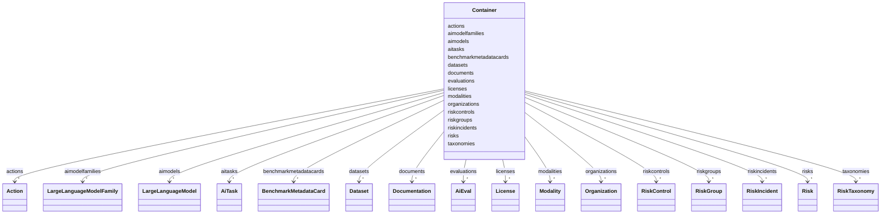

# Class: Container


_An umbrella object that holds the ontology class instances_


URI: [nexus:Container](https://ibm.github.io/risk-atlas-nexus/ontology/Container)





<!-- no inheritance hierarchy -->


## Slots

| Name | Cardinality and Range | Description | Inheritance |
| ---  | --- | --- | --- |
| [organizations](organizations.md) | * <br/> [Organization](Organization.md) | A list of organizations | direct |
| [licenses](licenses.md) | * <br/> [License](License.md) | A list of licenses | direct |
| [modalities](modalities.md) | * <br/> [Modality](Modality.md) | A list of AI modalities | direct |
| [aitasks](aitasks.md) | * <br/> [AiTask](AiTask.md) | A list of AI tasks | direct |
| [documents](documents.md) | * <br/> [Documentation](Documentation.md) | A list of documents | direct |
| [datasets](datasets.md) | * <br/> [Dataset](Dataset.md) | A list of data sets | direct |
| [taxonomies](taxonomies.md) | * <br/> [RiskTaxonomy](RiskTaxonomy.md) | A list of AI risk taxonomies | direct |
| [riskgroups](riskgroups.md) | * <br/> [RiskGroup](RiskGroup.md) | A list of AI risk groups | direct |
| [risks](risks.md) | * <br/> [Risk](Risk.md) | A list of AI risks | direct |
| [riskcontrols](riskcontrols.md) | * <br/> [RiskControl](RiskControl.md) | A list of AI risk controls | direct |
| [riskincidents](riskincidents.md) | * <br/> [RiskIncident](RiskIncident.md) | A list of AI risk incidents | direct |
| [actions](actions.md) | * <br/> [Action](Action.md) | A list of risk related actions | direct |
| [evaluations](evaluations.md) | * <br/> [AiEval](AiEval.md) | A list of AI evaluation methods | direct |
| [benchmarkmetadatacards](benchmarkmetadatacards.md) | * <br/> [BenchmarkMetadataCard](BenchmarkMetadataCard.md) | A list of AI evaluation benchmark metadata cards | direct |
| [aimodelfamilies](aimodelfamilies.md) | * <br/> [LargeLanguageModelFamily](LargeLanguageModelFamily.md) | A list of AI model families | direct |
| [aimodels](aimodels.md) | * <br/> [LargeLanguageModel](LargeLanguageModel.md) | A list of AI models | direct |


## Identifier and Mapping Information


### Schema Source


* from schema: https://ibm.github.io/risk-atlas-nexus/ontology/ai-risk-ontology


## Mappings

| Mapping Type | Mapped Value |
| ---  | ---  |
| self | nexus:Container |
| native | nexus:Container |


## LinkML Source

<!-- TODO: investigate https://stackoverflow.com/questions/37606292/how-to-create-tabbed-code-blocks-in-mkdocs-or-sphinx -->

### Direct

<details>
```yaml
name: Container
description: An umbrella object that holds the ontology class instances
from_schema: https://ibm.github.io/risk-atlas-nexus/ontology/ai-risk-ontology
attributes:
  organizations:
    name: organizations
    description: A list of organizations
    from_schema: https://ibm.github.io/risk-atlas-nexus/ontology/ai-risk-ontology
    rank: 1000
    domain_of:
    - Container
    range: Organization
    multivalued: true
    inlined: true
    inlined_as_list: true
  licenses:
    name: licenses
    description: A list of licenses
    from_schema: https://ibm.github.io/risk-atlas-nexus/ontology/ai-risk-ontology
    rank: 1000
    domain_of:
    - Container
    range: License
    multivalued: true
    inlined: true
    inlined_as_list: true
  modalities:
    name: modalities
    description: A list of AI modalities
    from_schema: https://ibm.github.io/risk-atlas-nexus/ontology/ai-risk-ontology
    rank: 1000
    domain_of:
    - Container
    range: Modality
    multivalued: true
    inlined: true
    inlined_as_list: true
  aitasks:
    name: aitasks
    description: A list of AI tasks
    from_schema: https://ibm.github.io/risk-atlas-nexus/ontology/ai-risk-ontology
    rank: 1000
    domain_of:
    - Container
    range: AiTask
    multivalued: true
    inlined: true
    inlined_as_list: true
  documents:
    name: documents
    description: A list of documents
    from_schema: https://ibm.github.io/risk-atlas-nexus/ontology/ai-risk-ontology
    rank: 1000
    domain_of:
    - Container
    range: Documentation
    multivalued: true
    inlined: true
    inlined_as_list: true
  datasets:
    name: datasets
    description: A list of data sets
    from_schema: https://ibm.github.io/risk-atlas-nexus/ontology/ai-risk-ontology
    rank: 1000
    domain_of:
    - Container
    range: Dataset
    multivalued: true
    inlined: true
    inlined_as_list: true
  taxonomies:
    name: taxonomies
    description: A list of AI risk taxonomies
    from_schema: https://ibm.github.io/risk-atlas-nexus/ontology/ai-risk-ontology
    rank: 1000
    domain_of:
    - Container
    range: RiskTaxonomy
    multivalued: true
    inlined: true
    inlined_as_list: true
  riskgroups:
    name: riskgroups
    description: A list of AI risk groups
    from_schema: https://ibm.github.io/risk-atlas-nexus/ontology/ai-risk-ontology
    rank: 1000
    domain_of:
    - Container
    range: RiskGroup
    multivalued: true
    inlined: true
    inlined_as_list: true
  risks:
    name: risks
    description: A list of AI risks
    from_schema: https://ibm.github.io/risk-atlas-nexus/ontology/ai-risk-ontology
    rank: 1000
    domain_of:
    - Container
    range: Risk
    multivalued: true
    inlined: true
    inlined_as_list: true
  riskcontrols:
    name: riskcontrols
    description: A list of AI risk controls
    from_schema: https://ibm.github.io/risk-atlas-nexus/ontology/ai-risk-ontology
    rank: 1000
    domain_of:
    - Container
    range: RiskControl
    multivalued: true
    inlined: true
    inlined_as_list: true
  riskincidents:
    name: riskincidents
    description: A list of AI risk incidents
    from_schema: https://ibm.github.io/risk-atlas-nexus/ontology/ai-risk-ontology
    rank: 1000
    domain_of:
    - Container
    range: RiskIncident
    multivalued: true
    inlined: true
    inlined_as_list: true
  actions:
    name: actions
    description: A list of risk related actions
    from_schema: https://ibm.github.io/risk-atlas-nexus/ontology/ai-risk-ontology
    rank: 1000
    domain_of:
    - Container
    range: Action
    multivalued: true
    inlined: true
    inlined_as_list: true
  evaluations:
    name: evaluations
    description: A list of AI evaluation methods
    from_schema: https://ibm.github.io/risk-atlas-nexus/ontology/ai-risk-ontology
    rank: 1000
    domain_of:
    - Container
    range: AiEval
    multivalued: true
    inlined: true
    inlined_as_list: true
  benchmarkmetadatacards:
    name: benchmarkmetadatacards
    description: A list of AI evaluation benchmark metadata cards
    from_schema: https://ibm.github.io/risk-atlas-nexus/ontology/ai-risk-ontology
    rank: 1000
    domain_of:
    - Container
    range: BenchmarkMetadataCard
    multivalued: true
    inlined: true
    inlined_as_list: true
  aimodelfamilies:
    name: aimodelfamilies
    description: A list of AI model families
    from_schema: https://ibm.github.io/risk-atlas-nexus/ontology/ai-risk-ontology
    rank: 1000
    domain_of:
    - Container
    range: LargeLanguageModelFamily
    multivalued: true
    inlined: true
    inlined_as_list: true
  aimodels:
    name: aimodels
    description: A list of AI models
    from_schema: https://ibm.github.io/risk-atlas-nexus/ontology/ai-risk-ontology
    rank: 1000
    domain_of:
    - Container
    range: LargeLanguageModel
    multivalued: true
    inlined: true
    inlined_as_list: true
tree_root: true

```
</details>

### Induced

<details>
```yaml
name: Container
description: An umbrella object that holds the ontology class instances
from_schema: https://ibm.github.io/risk-atlas-nexus/ontology/ai-risk-ontology
attributes:
  organizations:
    name: organizations
    description: A list of organizations
    from_schema: https://ibm.github.io/risk-atlas-nexus/ontology/ai-risk-ontology
    rank: 1000
    alias: organizations
    owner: Container
    domain_of:
    - Container
    range: Organization
    multivalued: true
    inlined: true
    inlined_as_list: true
  licenses:
    name: licenses
    description: A list of licenses
    from_schema: https://ibm.github.io/risk-atlas-nexus/ontology/ai-risk-ontology
    rank: 1000
    alias: licenses
    owner: Container
    domain_of:
    - Container
    range: License
    multivalued: true
    inlined: true
    inlined_as_list: true
  modalities:
    name: modalities
    description: A list of AI modalities
    from_schema: https://ibm.github.io/risk-atlas-nexus/ontology/ai-risk-ontology
    rank: 1000
    alias: modalities
    owner: Container
    domain_of:
    - Container
    range: Modality
    multivalued: true
    inlined: true
    inlined_as_list: true
  aitasks:
    name: aitasks
    description: A list of AI tasks
    from_schema: https://ibm.github.io/risk-atlas-nexus/ontology/ai-risk-ontology
    rank: 1000
    alias: aitasks
    owner: Container
    domain_of:
    - Container
    range: AiTask
    multivalued: true
    inlined: true
    inlined_as_list: true
  documents:
    name: documents
    description: A list of documents
    from_schema: https://ibm.github.io/risk-atlas-nexus/ontology/ai-risk-ontology
    rank: 1000
    alias: documents
    owner: Container
    domain_of:
    - Container
    range: Documentation
    multivalued: true
    inlined: true
    inlined_as_list: true
  datasets:
    name: datasets
    description: A list of data sets
    from_schema: https://ibm.github.io/risk-atlas-nexus/ontology/ai-risk-ontology
    rank: 1000
    alias: datasets
    owner: Container
    domain_of:
    - Container
    range: Dataset
    multivalued: true
    inlined: true
    inlined_as_list: true
  taxonomies:
    name: taxonomies
    description: A list of AI risk taxonomies
    from_schema: https://ibm.github.io/risk-atlas-nexus/ontology/ai-risk-ontology
    rank: 1000
    alias: taxonomies
    owner: Container
    domain_of:
    - Container
    range: RiskTaxonomy
    multivalued: true
    inlined: true
    inlined_as_list: true
  riskgroups:
    name: riskgroups
    description: A list of AI risk groups
    from_schema: https://ibm.github.io/risk-atlas-nexus/ontology/ai-risk-ontology
    rank: 1000
    alias: riskgroups
    owner: Container
    domain_of:
    - Container
    range: RiskGroup
    multivalued: true
    inlined: true
    inlined_as_list: true
  risks:
    name: risks
    description: A list of AI risks
    from_schema: https://ibm.github.io/risk-atlas-nexus/ontology/ai-risk-ontology
    rank: 1000
    alias: risks
    owner: Container
    domain_of:
    - Container
    range: Risk
    multivalued: true
    inlined: true
    inlined_as_list: true
  riskcontrols:
    name: riskcontrols
    description: A list of AI risk controls
    from_schema: https://ibm.github.io/risk-atlas-nexus/ontology/ai-risk-ontology
    rank: 1000
    alias: riskcontrols
    owner: Container
    domain_of:
    - Container
    range: RiskControl
    multivalued: true
    inlined: true
    inlined_as_list: true
  riskincidents:
    name: riskincidents
    description: A list of AI risk incidents
    from_schema: https://ibm.github.io/risk-atlas-nexus/ontology/ai-risk-ontology
    rank: 1000
    alias: riskincidents
    owner: Container
    domain_of:
    - Container
    range: RiskIncident
    multivalued: true
    inlined: true
    inlined_as_list: true
  actions:
    name: actions
    description: A list of risk related actions
    from_schema: https://ibm.github.io/risk-atlas-nexus/ontology/ai-risk-ontology
    rank: 1000
    alias: actions
    owner: Container
    domain_of:
    - Container
    range: Action
    multivalued: true
    inlined: true
    inlined_as_list: true
  evaluations:
    name: evaluations
    description: A list of AI evaluation methods
    from_schema: https://ibm.github.io/risk-atlas-nexus/ontology/ai-risk-ontology
    rank: 1000
    alias: evaluations
    owner: Container
    domain_of:
    - Container
    range: AiEval
    multivalued: true
    inlined: true
    inlined_as_list: true
  benchmarkmetadatacards:
    name: benchmarkmetadatacards
    description: A list of AI evaluation benchmark metadata cards
    from_schema: https://ibm.github.io/risk-atlas-nexus/ontology/ai-risk-ontology
    rank: 1000
    alias: benchmarkmetadatacards
    owner: Container
    domain_of:
    - Container
    range: BenchmarkMetadataCard
    multivalued: true
    inlined: true
    inlined_as_list: true
  aimodelfamilies:
    name: aimodelfamilies
    description: A list of AI model families
    from_schema: https://ibm.github.io/risk-atlas-nexus/ontology/ai-risk-ontology
    rank: 1000
    alias: aimodelfamilies
    owner: Container
    domain_of:
    - Container
    range: LargeLanguageModelFamily
    multivalued: true
    inlined: true
    inlined_as_list: true
  aimodels:
    name: aimodels
    description: A list of AI models
    from_schema: https://ibm.github.io/risk-atlas-nexus/ontology/ai-risk-ontology
    rank: 1000
    alias: aimodels
    owner: Container
    domain_of:
    - Container
    range: LargeLanguageModel
    multivalued: true
    inlined: true
    inlined_as_list: true
tree_root: true

```
</details>
