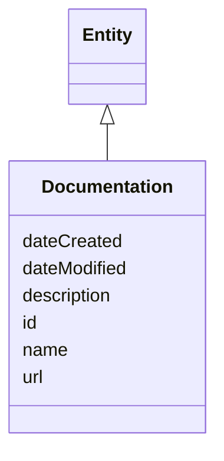

# Class: Documentation


_Documented information about a concept or other topic(s) of interest._


URI: [airo:Documentation](https://w3id.org/airo#Documentation)





## Inheritance
* [Entity](Entity.md)
    * **Documentation**


## Slots

| Name | Cardinality and Range | Description | Inheritance |
| ---  | --- | --- | --- |
| [id](id.md) | 1 <br/> [String](String.md) | A unique identifier to this instance of the model element | [Entity](Entity.md) |
| [name](name.md) | 0..1 <br/> [String](String.md) | A text name of this instance | [Entity](Entity.md) |
| [description](description.md) | 0..1 <br/> [String](String.md) | The description of an entity | [Entity](Entity.md) |
| [url](url.md) | 0..1 <br/> [Uri](Uri.md) | An optional URL associated with this instance | [Entity](Entity.md) |
| [dateCreated](dateCreated.md) | 0..1 <br/> [Date](Date.md) | The date on which the entity was created | [Entity](Entity.md) |
| [dateModified](dateModified.md) | 0..1 <br/> [Date](Date.md) | The date on which the entity was most recently modified | [Entity](Entity.md) |


## Usages

| used by | used in | type | used |
| ---  | --- | --- | --- |
| [Container](Container.md) | [documents](documents.md) | range | [Documentation](Documentation.md) |
| [Dataset](Dataset.md) | [hasDocumentation](hasDocumentation.md) | range | [Documentation](Documentation.md) |
| [RiskTaxonomy](RiskTaxonomy.md) | [hasDocumentation](hasDocumentation.md) | range | [Documentation](Documentation.md) |
| [Action](Action.md) | [hasDocumentation](hasDocumentation.md) | range | [Documentation](Documentation.md) |
| [AiEval](AiEval.md) | [hasDocumentation](hasDocumentation.md) | range | [Documentation](Documentation.md) |
| [Question](Question.md) | [hasDocumentation](hasDocumentation.md) | range | [Documentation](Documentation.md) |
| [Questionnaire](Questionnaire.md) | [hasDocumentation](hasDocumentation.md) | range | [Documentation](Documentation.md) |
| [BaseAi](BaseAi.md) | [hasDocumentation](hasDocumentation.md) | range | [Documentation](Documentation.md) |
| [AiSystem](AiSystem.md) | [hasDocumentation](hasDocumentation.md) | range | [Documentation](Documentation.md) |
| [AiModel](AiModel.md) | [hasDocumentation](hasDocumentation.md) | range | [Documentation](Documentation.md) |
| [LargeLanguageModel](LargeLanguageModel.md) | [hasDocumentation](hasDocumentation.md) | range | [Documentation](Documentation.md) |
| [LargeLanguageModelFamily](LargeLanguageModelFamily.md) | [hasDocumentation](hasDocumentation.md) | range | [Documentation](Documentation.md) |


## Identifier and Mapping Information


### Schema Source


* from schema: http://research.ibm.com/ontologies/aiont/ai-risk-ontology


## Mappings

| Mapping Type | Mapped Value |
| ---  | ---  |
| self | airo:Documentation |
| native | nexus:Documentation |


## LinkML Source

<!-- TODO: investigate https://stackoverflow.com/questions/37606292/how-to-create-tabbed-code-blocks-in-mkdocs-or-sphinx -->

### Direct

<details>
```yaml
name: Documentation
description: Documented information about a concept or other topic(s) of interest.
from_schema: http://research.ibm.com/ontologies/aiont/ai-risk-ontology
is_a: Entity
class_uri: airo:Documentation

```
</details>

### Induced

<details>
```yaml
name: Documentation
description: Documented information about a concept or other topic(s) of interest.
from_schema: http://research.ibm.com/ontologies/aiont/ai-risk-ontology
is_a: Entity
attributes:
  id:
    name: id
    description: A unique identifier to this instance of the model element. Example
      identifiers include UUID, URI, URN, etc.
    from_schema: http://research.ibm.com/ontologies/aiont/ai-risk-ontology
    rank: 1000
    slot_uri: schema:identifier
    identifier: true
    alias: id
    owner: Documentation
    domain_of:
    - Entity
    range: string
    required: true
  name:
    name: name
    description: A text name of this instance.
    from_schema: http://research.ibm.com/ontologies/aiont/ai-risk-ontology
    rank: 1000
    slot_uri: schema:name
    alias: name
    owner: Documentation
    domain_of:
    - Entity
    range: string
  description:
    name: description
    description: The description of an entity
    from_schema: http://research.ibm.com/ontologies/aiont/ai-risk-ontology
    rank: 1000
    slot_uri: schema:description
    alias: description
    owner: Documentation
    domain_of:
    - Entity
    range: string
  url:
    name: url
    description: An optional URL associated with this instance.
    from_schema: http://research.ibm.com/ontologies/aiont/ai-risk-ontology
    rank: 1000
    slot_uri: schema:url
    alias: url
    owner: Documentation
    domain_of:
    - Entity
    range: uri
  dateCreated:
    name: dateCreated
    description: The date on which the entity was created.
    from_schema: http://research.ibm.com/ontologies/aiont/ai-risk-ontology
    rank: 1000
    slot_uri: schema:dateCreated
    alias: dateCreated
    owner: Documentation
    domain_of:
    - Entity
    range: date
    required: false
  dateModified:
    name: dateModified
    description: The date on which the entity was most recently modified.
    from_schema: http://research.ibm.com/ontologies/aiont/ai-risk-ontology
    rank: 1000
    slot_uri: schema:dateModified
    alias: dateModified
    owner: Documentation
    domain_of:
    - Entity
    range: date
    required: false
class_uri: airo:Documentation

```
</details>