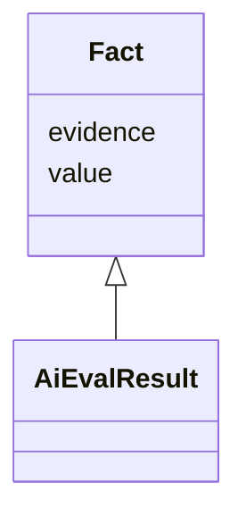

# Class: Fact


_A fact about something, for example the result of a measurement. In addition to the value, evidence is provided._


* __NOTE__: this is an abstract class and should not be instantiated directly


URI: [schema:Statement](http://schema.org/Statement)





<!-- no inheritance hierarchy -->


## Slots

| Name | Cardinality and Range | Description | Inheritance |
| ---  | --- | --- | --- |
| [value](value.md) | 1 <br/> [String](String.md) | Some numeric or string value | direct |
| [evidence](evidence.md) | 0..1 <br/> [String](String.md) | Evidence provides a source (typical a chunk, paragraph or link) describing wh... | direct |


## Identifier and Mapping Information


### Schema Source


* from schema: https://ibm.github.io/risk-atlas-nexus/ontology/ai-risk-ontology


## Mappings

| Mapping Type | Mapped Value |
| ---  | ---  |
| self | schema:Statement |
| native | nexus:Fact |


## LinkML Source

<!-- TODO: investigate https://stackoverflow.com/questions/37606292/how-to-create-tabbed-code-blocks-in-mkdocs-or-sphinx -->

### Direct

<details>
```yaml
name: Fact
description: A fact about something, for example the result of a measurement. In addition
  to the value, evidence is provided.
from_schema: https://ibm.github.io/risk-atlas-nexus/ontology/ai-risk-ontology
abstract: true
slots:
- value
- evidence
class_uri: schema:Statement

```
</details>

### Induced

<details>
```yaml
name: Fact
description: A fact about something, for example the result of a measurement. In addition
  to the value, evidence is provided.
from_schema: https://ibm.github.io/risk-atlas-nexus/ontology/ai-risk-ontology
abstract: true
attributes:
  value:
    name: value
    description: Some numeric or string value
    from_schema: https://ibm.github.io/risk-atlas-nexus/ontology/ai-risk-ontology
    rank: 1000
    alias: value
    owner: Fact
    domain_of:
    - Fact
    range: string
    required: true
  evidence:
    name: evidence
    description: Evidence provides a source (typical a chunk, paragraph or link) describing
      where some value was found or how it was generated.
    from_schema: https://ibm.github.io/risk-atlas-nexus/ontology/ai-risk-ontology
    rank: 1000
    alias: evidence
    owner: Fact
    domain_of:
    - Fact
    range: string
class_uri: schema:Statement

```
</details>