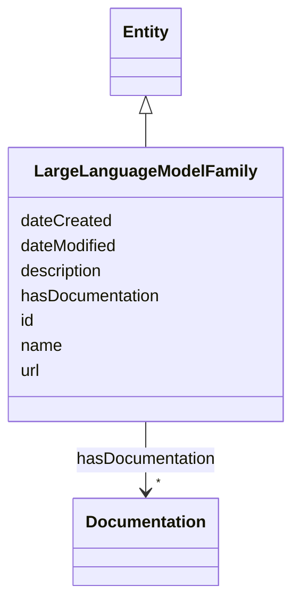

# Class: LargeLanguageModelFamily


_A large language model family is a set of models that are provided by the same AI systems provider and are built around the same architecture, but differ e.g. in the number of parameters. Examples are Meta's Llama2 family or the IBM granite models._


URI: [nexus:LargeLanguageModelFamily](https://ibm.github.io/risk-atlas-nexus/ontology/LargeLanguageModelFamily)





## Inheritance
* [Entity](Entity.md)
    * **LargeLanguageModelFamily**


## Slots

| Name | Cardinality and Range | Description | Inheritance |
| ---  | --- | --- | --- |
| [hasDocumentation](hasDocumentation.md) | * <br/> [Documentation](Documentation.md) | Indicates documentation associated with an entity | direct |
| [id](id.md) | 1 <br/> [String](String.md) | A unique identifier to this instance of the model element | [Entity](Entity.md) |
| [name](name.md) | 0..1 <br/> [String](String.md) | A text name of this instance | [Entity](Entity.md) |
| [description](description.md) | 0..1 <br/> [String](String.md) | The description of an entity | [Entity](Entity.md) |
| [url](url.md) | 0..1 <br/> [Uri](Uri.md) | An optional URL associated with this instance | [Entity](Entity.md) |
| [dateCreated](dateCreated.md) | 0..1 <br/> [Date](Date.md) | The date on which the entity was created | [Entity](Entity.md) |
| [dateModified](dateModified.md) | 0..1 <br/> [Date](Date.md) | The date on which the entity was most recently modified | [Entity](Entity.md) |


## Usages

| used by | used in | type | used |
| ---  | --- | --- | --- |
| [Container](Container.md) | [aimodelfamilies](aimodelfamilies.md) | range | [LargeLanguageModelFamily](LargeLanguageModelFamily.md) |
| [LargeLanguageModel](LargeLanguageModel.md) | [isPartOf](isPartOf.md) | range | [LargeLanguageModelFamily](LargeLanguageModelFamily.md) |


## Identifier and Mapping Information


### Schema Source


* from schema: https://ibm.github.io/risk-atlas-nexus/ontology/ai-risk-ontology


## Mappings

| Mapping Type | Mapped Value |
| ---  | ---  |
| self | nexus:LargeLanguageModelFamily |
| native | nexus:LargeLanguageModelFamily |


## LinkML Source

<!-- TODO: investigate https://stackoverflow.com/questions/37606292/how-to-create-tabbed-code-blocks-in-mkdocs-or-sphinx -->

### Direct

<details>
```yaml
name: LargeLanguageModelFamily
description: A large language model family is a set of models that are provided by
  the same AI systems provider and are built around the same architecture, but differ
  e.g. in the number of parameters. Examples are Meta's Llama2 family or the IBM granite
  models.
from_schema: https://ibm.github.io/risk-atlas-nexus/ontology/ai-risk-ontology
is_a: Entity
slots:
- hasDocumentation

```
</details>

### Induced

<details>
```yaml
name: LargeLanguageModelFamily
description: A large language model family is a set of models that are provided by
  the same AI systems provider and are built around the same architecture, but differ
  e.g. in the number of parameters. Examples are Meta's Llama2 family or the IBM granite
  models.
from_schema: https://ibm.github.io/risk-atlas-nexus/ontology/ai-risk-ontology
is_a: Entity
attributes:
  hasDocumentation:
    name: hasDocumentation
    description: Indicates documentation associated with an entity.
    from_schema: https://ibm.github.io/risk-atlas-nexus/ontology/ai-risk-ontology
    rank: 1000
    slot_uri: airo:hasDocumentation
    alias: hasDocumentation
    owner: LargeLanguageModelFamily
    domain_of:
    - Dataset
    - RiskTaxonomy
    - Action
    - AiEval
    - BenchmarkMetadataCard
    - BaseAi
    - LargeLanguageModelFamily
    range: Documentation
    multivalued: true
    inlined: false
  id:
    name: id
    description: A unique identifier to this instance of the model element. Example
      identifiers include UUID, URI, URN, etc.
    from_schema: https://ibm.github.io/risk-atlas-nexus/ontology/ai-risk-ontology
    rank: 1000
    slot_uri: schema:identifier
    identifier: true
    alias: id
    owner: LargeLanguageModelFamily
    domain_of:
    - Entity
    range: string
    required: true
  name:
    name: name
    description: A text name of this instance.
    from_schema: https://ibm.github.io/risk-atlas-nexus/ontology/ai-risk-ontology
    rank: 1000
    slot_uri: schema:name
    alias: name
    owner: LargeLanguageModelFamily
    domain_of:
    - Entity
    - BenchmarkMetadataCard
    range: string
  description:
    name: description
    description: The description of an entity
    from_schema: https://ibm.github.io/risk-atlas-nexus/ontology/ai-risk-ontology
    rank: 1000
    slot_uri: schema:description
    alias: description
    owner: LargeLanguageModelFamily
    domain_of:
    - Entity
    range: string
  url:
    name: url
    description: An optional URL associated with this instance.
    from_schema: https://ibm.github.io/risk-atlas-nexus/ontology/ai-risk-ontology
    rank: 1000
    slot_uri: schema:url
    alias: url
    owner: LargeLanguageModelFamily
    domain_of:
    - Entity
    range: uri
  dateCreated:
    name: dateCreated
    description: The date on which the entity was created.
    from_schema: https://ibm.github.io/risk-atlas-nexus/ontology/ai-risk-ontology
    rank: 1000
    slot_uri: schema:dateCreated
    alias: dateCreated
    owner: LargeLanguageModelFamily
    domain_of:
    - Entity
    range: date
    required: false
  dateModified:
    name: dateModified
    description: The date on which the entity was most recently modified.
    from_schema: https://ibm.github.io/risk-atlas-nexus/ontology/ai-risk-ontology
    rank: 1000
    slot_uri: schema:dateModified
    alias: dateModified
    owner: LargeLanguageModelFamily
    domain_of:
    - Entity
    range: date
    required: false

```
</details>