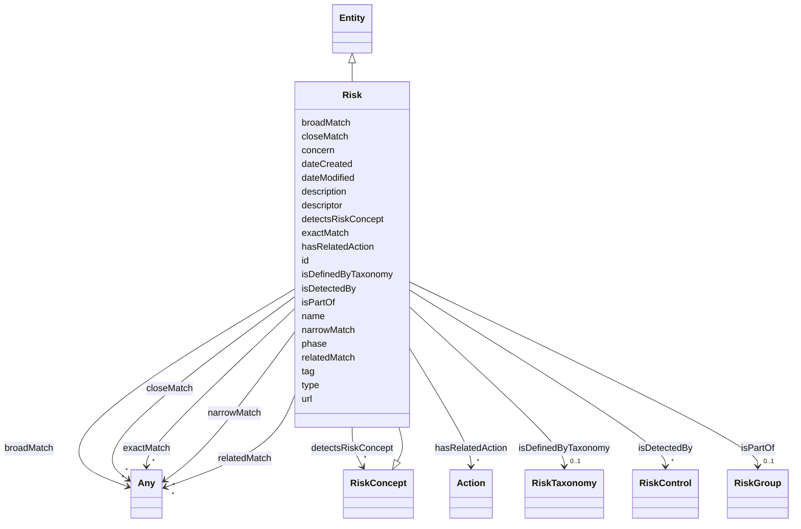

# Class: Risk


_The state of uncertainty associated with an AI system, that has the potential to cause harms_


URI: [airo:Risk](https://w3id.org/airo#Risk)





## Inheritance
* [Entity](Entity.md)
    * **Risk** [ [RiskConcept](RiskConcept.md)]


## Slots

| Name | Cardinality and Range | Description | Inheritance |
| ---  | --- | --- | --- |
| [hasRelatedAction](hasRelatedAction.md) | * <br/> [Action](Action.md) | A relationship where an entity relates to an action | direct |
| [isDefinedByTaxonomy](isDefinedByTaxonomy.md) | 0..1 <br/> [RiskTaxonomy](RiskTaxonomy.md) | A relationship where a risk or a risk group is defined by a risk taxonomy | direct |
| [isPartOf](isPartOf.md) | 0..1 <br/> [RiskGroup](RiskGroup.md) | A relationship where a risk is part of a risk group | direct |
| [closeMatch](closeMatch.md) | * <br/> [Any](Any.md)&nbsp;or&nbsp;<br />[Risk](Risk.md)&nbsp;or&nbsp;<br />[RiskGroup](RiskGroup.md) | The property is used to link two concepts that are sufficiently similar that ... | direct |
| [exactMatch](exactMatch.md) | * <br/> [Any](Any.md)&nbsp;or&nbsp;<br />[Risk](Risk.md)&nbsp;or&nbsp;<br />[RiskGroup](RiskGroup.md) | The property is used to link two concepts, indicating a high degree of confid... | direct |
| [broadMatch](broadMatch.md) | * <br/> [Any](Any.md)&nbsp;or&nbsp;<br />[Risk](Risk.md)&nbsp;or&nbsp;<br />[RiskGroup](RiskGroup.md) | The property is used to state a hierarchical mapping link between two concept... | direct |
| [narrowMatch](narrowMatch.md) | * <br/> [Any](Any.md)&nbsp;or&nbsp;<br />[Risk](Risk.md)&nbsp;or&nbsp;<br />[RiskGroup](RiskGroup.md) | The property is used to state a hierarchical mapping link between two concept... | direct |
| [relatedMatch](relatedMatch.md) | * <br/> [Any](Any.md)&nbsp;or&nbsp;<br />[Risk](Risk.md)&nbsp;or&nbsp;<br />[RiskGroup](RiskGroup.md) | The property skos:relatedMatch is used to state an associative mapping link b... | direct |
| [detectsRiskConcept](detectsRiskConcept.md) | * <br/> [RiskConcept](RiskConcept.md) | The property airo:detectsRiskConcept indicates the control used for detecting... | direct |
| [tag](tag.md) | 0..1 <br/> [String](String.md) | A shost version of the name | direct |
| [type](type.md) | 0..1 <br/> [String](String.md) | Annotation whether an AI risk occurs at input or output or is non-technical | direct |
| [phase](phase.md) | 0..1 <br/> [String](String.md) | Annotation whether an AI risk shows specifically during the training-tuning o... | direct |
| [descriptor](descriptor.md) | 0..1 <br/> [String](String.md) | Annotates whether an AI risk is a traditional risk, specific to or amplified ... | direct |
| [concern](concern.md) | 0..1 <br/> [String](String.md) | Some explanation about the concern related to an AI risk | direct |
| [isDetectedBy](isDetectedBy.md) | * <br/> [RiskControl](RiskControl.md) | A relationship where a risk, risk source, consequence, or impact is detected ... | [RiskConcept](RiskConcept.md) |
| [id](id.md) | 1 <br/> [String](String.md) | A unique identifier to this instance of the model element | [Entity](Entity.md) |
| [name](name.md) | 0..1 <br/> [String](String.md) | A text name of this instance | [Entity](Entity.md) |
| [description](description.md) | 0..1 <br/> [String](String.md) | The description of an entity | [Entity](Entity.md) |
| [url](url.md) | 0..1 <br/> [Uri](Uri.md) | An optional URL associated with this instance | [Entity](Entity.md) |
| [dateCreated](dateCreated.md) | 0..1 <br/> [Date](Date.md) | The date on which the entity was created | [Entity](Entity.md) |
| [dateModified](dateModified.md) | 0..1 <br/> [Date](Date.md) | The date on which the entity was most recently modified | [Entity](Entity.md) |


## Usages

| used by | used in | type | used |
| ---  | --- | --- | --- |
| [Container](Container.md) | [risks](risks.md) | range | [Risk](Risk.md) |
| [RiskGroup](RiskGroup.md) | [closeMatch](closeMatch.md) | any_of[range] | [Risk](Risk.md) |
| [RiskGroup](RiskGroup.md) | [exactMatch](exactMatch.md) | any_of[range] | [Risk](Risk.md) |
| [RiskGroup](RiskGroup.md) | [broadMatch](broadMatch.md) | any_of[range] | [Risk](Risk.md) |
| [RiskGroup](RiskGroup.md) | [narrowMatch](narrowMatch.md) | any_of[range] | [Risk](Risk.md) |
| [RiskGroup](RiskGroup.md) | [relatedMatch](relatedMatch.md) | any_of[range] | [Risk](Risk.md) |
| [RiskGroup](RiskGroup.md) | [hasPart](hasPart.md) | range | [Risk](Risk.md) |
| [Risk](Risk.md) | [closeMatch](closeMatch.md) | any_of[range] | [Risk](Risk.md) |
| [Risk](Risk.md) | [exactMatch](exactMatch.md) | any_of[range] | [Risk](Risk.md) |
| [Risk](Risk.md) | [broadMatch](broadMatch.md) | any_of[range] | [Risk](Risk.md) |
| [Risk](Risk.md) | [narrowMatch](narrowMatch.md) | any_of[range] | [Risk](Risk.md) |
| [Risk](Risk.md) | [relatedMatch](relatedMatch.md) | any_of[range] | [Risk](Risk.md) |
| [Action](Action.md) | [hasRelatedRisk](hasRelatedRisk.md) | range | [Risk](Risk.md) |
| [AiEval](AiEval.md) | [hasRelatedRisk](hasRelatedRisk.md) | range | [Risk](Risk.md) |
| [Question](Question.md) | [hasRelatedRisk](hasRelatedRisk.md) | range | [Risk](Risk.md) |
| [Questionnaire](Questionnaire.md) | [hasRelatedRisk](hasRelatedRisk.md) | range | [Risk](Risk.md) |


## Identifier and Mapping Information


### Schema Source


* from schema: http://research.ibm.com/ontologies/aiont/ai-risk-ontology


## Mappings

| Mapping Type | Mapped Value |
| ---  | ---  |
| self | airo:Risk |
| native | nexus:Risk |


## LinkML Source

<!-- TODO: investigate https://stackoverflow.com/questions/37606292/how-to-create-tabbed-code-blocks-in-mkdocs-or-sphinx -->

### Direct

<details>
```yaml
name: Risk
description: The state of uncertainty associated with an AI system, that has the potential
  to cause harms
from_schema: http://research.ibm.com/ontologies/aiont/ai-risk-ontology
is_a: Entity
mixins:
- RiskConcept
slots:
- hasRelatedAction
- isDefinedByTaxonomy
- isPartOf
- closeMatch
- exactMatch
- broadMatch
- narrowMatch
- relatedMatch
- detectsRiskConcept
slot_usage:
  isPartOf:
    name: isPartOf
    description: A relationship where a risk is part of a risk group
    range: RiskGroup
attributes:
  tag:
    name: tag
    description: A shost version of the name
    from_schema: http://research.ibm.com/ontologies/aiont/ai_risk
    rank: 1000
    domain_of:
    - Risk
  type:
    name: type
    description: Annotation whether an AI risk occurs at input or output or is non-technical.
    from_schema: http://research.ibm.com/ontologies/aiont/ai_risk
    rank: 1000
    domain_of:
    - Risk
  phase:
    name: phase
    description: Annotation whether an AI risk shows specifically during the training-tuning
      or inference phase.
    from_schema: http://research.ibm.com/ontologies/aiont/ai_risk
    rank: 1000
    domain_of:
    - Risk
  descriptor:
    name: descriptor
    description: Annotates whether an AI risk is a traditional risk, specific to or
      amplified by AI.
    from_schema: http://research.ibm.com/ontologies/aiont/ai_risk
    rank: 1000
    domain_of:
    - Risk
  concern:
    name: concern
    description: Some explanation about the concern related to an AI risk
    from_schema: http://research.ibm.com/ontologies/aiont/ai_risk
    rank: 1000
    domain_of:
    - Risk
class_uri: airo:Risk

```
</details>

### Induced

<details>
```yaml
name: Risk
description: The state of uncertainty associated with an AI system, that has the potential
  to cause harms
from_schema: http://research.ibm.com/ontologies/aiont/ai-risk-ontology
is_a: Entity
mixins:
- RiskConcept
slot_usage:
  isPartOf:
    name: isPartOf
    description: A relationship where a risk is part of a risk group
    range: RiskGroup
attributes:
  tag:
    name: tag
    description: A shost version of the name
    from_schema: http://research.ibm.com/ontologies/aiont/ai_risk
    rank: 1000
    alias: tag
    owner: Risk
    domain_of:
    - Risk
    range: string
  type:
    name: type
    description: Annotation whether an AI risk occurs at input or output or is non-technical.
    from_schema: http://research.ibm.com/ontologies/aiont/ai_risk
    rank: 1000
    alias: type
    owner: Risk
    domain_of:
    - Risk
    range: string
  phase:
    name: phase
    description: Annotation whether an AI risk shows specifically during the training-tuning
      or inference phase.
    from_schema: http://research.ibm.com/ontologies/aiont/ai_risk
    rank: 1000
    alias: phase
    owner: Risk
    domain_of:
    - Risk
    range: string
  descriptor:
    name: descriptor
    description: Annotates whether an AI risk is a traditional risk, specific to or
      amplified by AI.
    from_schema: http://research.ibm.com/ontologies/aiont/ai_risk
    rank: 1000
    alias: descriptor
    owner: Risk
    domain_of:
    - Risk
    range: string
  concern:
    name: concern
    description: Some explanation about the concern related to an AI risk
    from_schema: http://research.ibm.com/ontologies/aiont/ai_risk
    rank: 1000
    alias: concern
    owner: Risk
    domain_of:
    - Risk
    range: string
  hasRelatedAction:
    name: hasRelatedAction
    description: A relationship where an entity relates to an action
    from_schema: http://research.ibm.com/ontologies/aiont/ai-risk-ontology
    rank: 1000
    alias: hasRelatedAction
    owner: Risk
    domain_of:
    - Risk
    range: Action
    multivalued: true
    inlined: false
  isDefinedByTaxonomy:
    name: isDefinedByTaxonomy
    description: A relationship where a risk or a risk group is defined by a risk
      taxonomy
    from_schema: http://research.ibm.com/ontologies/aiont/ai-risk-ontology
    rank: 1000
    slot_uri: schema:isPartOf
    alias: isDefinedByTaxonomy
    owner: Risk
    domain_of:
    - RiskGroup
    - Risk
    - RiskControl
    range: RiskTaxonomy
  isPartOf:
    name: isPartOf
    description: A relationship where a risk is part of a risk group
    from_schema: http://research.ibm.com/ontologies/aiont/ai-risk-ontology
    rank: 1000
    slot_uri: schema:isPartOf
    alias: isPartOf
    owner: Risk
    domain_of:
    - Risk
    - LargeLanguageModel
    range: RiskGroup
  closeMatch:
    name: closeMatch
    description: The property is used to link two concepts that are sufficiently similar
      that they can be used interchangeably in some information retrieval applications.
    from_schema: http://research.ibm.com/ontologies/aiont/ai-risk-ontology
    rank: 1000
    slot_uri: skos:closeMatch
    alias: closeMatch
    owner: Risk
    domain_of:
    - RiskGroup
    - Risk
    range: Any
    multivalued: true
    inlined: false
    any_of:
    - range: Risk
    - range: RiskGroup
  exactMatch:
    name: exactMatch
    description: The property is used to link two concepts, indicating a high degree
      of confidence that the concepts can be used interchangeably across a wide range
      of information retrieval applications
    from_schema: http://research.ibm.com/ontologies/aiont/ai-risk-ontology
    rank: 1000
    slot_uri: skos:exactMatch
    alias: exactMatch
    owner: Risk
    domain_of:
    - RiskGroup
    - Risk
    range: Any
    multivalued: true
    inlined: false
    any_of:
    - range: Risk
    - range: RiskGroup
  broadMatch:
    name: broadMatch
    description: The property is used to state a hierarchical mapping link between
      two concepts, indicating that the concept linked to, is a broader concept than
      the originating concept.
    from_schema: http://research.ibm.com/ontologies/aiont/ai-risk-ontology
    rank: 1000
    slot_uri: skos:broadMatch
    alias: broadMatch
    owner: Risk
    domain_of:
    - RiskGroup
    - Risk
    range: Any
    multivalued: true
    inlined: false
    any_of:
    - range: Risk
    - range: RiskGroup
  narrowMatch:
    name: narrowMatch
    description: The property is used to state a hierarchical mapping link between
      two concepts, indicating that the concept linked to, is a narrower concept than
      the originating concept.
    from_schema: http://research.ibm.com/ontologies/aiont/ai-risk-ontology
    rank: 1000
    slot_uri: skos:narrowMatch
    alias: narrowMatch
    owner: Risk
    domain_of:
    - RiskGroup
    - Risk
    range: Any
    multivalued: true
    inlined: false
    any_of:
    - range: Risk
    - range: RiskGroup
  relatedMatch:
    name: relatedMatch
    description: The property skos:relatedMatch is used to state an associative mapping
      link between two concepts.
    from_schema: http://research.ibm.com/ontologies/aiont/ai-risk-ontology
    rank: 1000
    slot_uri: skos:relatedMatch
    alias: relatedMatch
    owner: Risk
    domain_of:
    - RiskGroup
    - Risk
    range: Any
    multivalued: true
    inlined: false
    any_of:
    - range: Risk
    - range: RiskGroup
  detectsRiskConcept:
    name: detectsRiskConcept
    description: The property airo:detectsRiskConcept indicates the control used for
      detecting risks, risk sources,  consequences, and impacts.
    from_schema: http://research.ibm.com/ontologies/aiont/ai-risk-ontology
    exact_mappings:
    - airo:detectsRiskConcept
    rank: 1000
    alias: detectsRiskConcept
    owner: Risk
    domain_of:
    - Risk
    - RiskControl
    inverse: isDetectedBy
    range: RiskConcept
    multivalued: true
    inlined: false
  isDetectedBy:
    name: isDetectedBy
    description: A relationship where a risk, risk source, consequence, or impact
      is detected by a risk control.
    from_schema: http://research.ibm.com/ontologies/aiont/ai-risk-ontology
    rank: 1000
    alias: isDetectedBy
    owner: Risk
    domain_of:
    - RiskConcept
    inverse: detectsRiskConcept
    range: RiskControl
    multivalued: true
    inlined: false
  id:
    name: id
    description: A unique identifier to this instance of the model element. Example
      identifiers include UUID, URI, URN, etc.
    from_schema: http://research.ibm.com/ontologies/aiont/ai-risk-ontology
    rank: 1000
    slot_uri: schema:identifier
    identifier: true
    alias: id
    owner: Risk
    domain_of:
    - Entity
    range: string
    required: true
  name:
    name: name
    description: A text name of this instance.
    from_schema: http://research.ibm.com/ontologies/aiont/ai-risk-ontology
    rank: 1000
    slot_uri: schema:name
    alias: name
    owner: Risk
    domain_of:
    - Entity
    range: string
  description:
    name: description
    description: The description of an entity
    from_schema: http://research.ibm.com/ontologies/aiont/ai-risk-ontology
    rank: 1000
    slot_uri: schema:description
    alias: description
    owner: Risk
    domain_of:
    - Entity
    range: string
  url:
    name: url
    description: An optional URL associated with this instance.
    from_schema: http://research.ibm.com/ontologies/aiont/ai-risk-ontology
    rank: 1000
    slot_uri: schema:url
    alias: url
    owner: Risk
    domain_of:
    - Entity
    range: uri
  dateCreated:
    name: dateCreated
    description: The date on which the entity was created.
    from_schema: http://research.ibm.com/ontologies/aiont/ai-risk-ontology
    rank: 1000
    slot_uri: schema:dateCreated
    alias: dateCreated
    owner: Risk
    domain_of:
    - Entity
    range: date
    required: false
  dateModified:
    name: dateModified
    description: The date on which the entity was most recently modified.
    from_schema: http://research.ibm.com/ontologies/aiont/ai-risk-ontology
    rank: 1000
    slot_uri: schema:dateModified
    alias: dateModified
    owner: Risk
    domain_of:
    - Entity
    range: date
    required: false
class_uri: airo:Risk

```
</details>