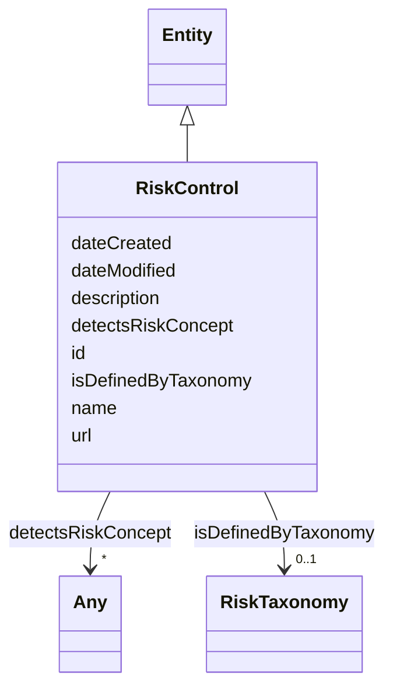

# Class: RiskControl


_A measure that maintains and/or modifies risk (and risk concepts)_


URI: [airo:RiskControl](https://w3id.org/airo#RiskControl)





## Inheritance
* [Entity](Entity.md)
    * **RiskControl**


## Slots

| Name | Cardinality and Range | Description | Inheritance |
| ---  | --- | --- | --- |
| [detectsRiskConcept](detectsRiskConcept.md) | * <br/> [Any](Any.md)&nbsp;or&nbsp;<br />[Risk](Risk.md)&nbsp;or&nbsp;<br />[RiskGroup](RiskGroup.md) | The property airo:detectsRiskConcept indicates the control used for detecting... | direct |
| [isDefinedByTaxonomy](isDefinedByTaxonomy.md) | 0..1 <br/> [RiskTaxonomy](RiskTaxonomy.md) | A relationship where a risk or a risk group is defined by a risk taxonomy | direct |
| [id](id.md) | 1 <br/> [String](String.md) | A unique identifier to this instance of the model element | [Entity](Entity.md) |
| [name](name.md) | 0..1 <br/> [String](String.md) | A text name of this instance | [Entity](Entity.md) |
| [description](description.md) | 0..1 <br/> [String](String.md) | The description of an entity | [Entity](Entity.md) |
| [url](url.md) | 0..1 <br/> [Uri](Uri.md) | An optional URL associated with this instance | [Entity](Entity.md) |
| [dateCreated](dateCreated.md) | 0..1 <br/> [Date](Date.md) | The date on which the entity was created | [Entity](Entity.md) |
| [dateModified](dateModified.md) | 0..1 <br/> [Date](Date.md) | The date on which the entity was most recently modified | [Entity](Entity.md) |


## Usages

| used by | used in | type | used |
| ---  | --- | --- | --- |
| [Container](Container.md) | [riskcontrols](riskcontrols.md) | range | [RiskControl](RiskControl.md) |
| [AiModel](AiModel.md) | [hasRiskControl](hasRiskControl.md) | range | [RiskControl](RiskControl.md) |
| [LargeLanguageModel](LargeLanguageModel.md) | [hasRiskControl](hasRiskControl.md) | range | [RiskControl](RiskControl.md) |


## Identifier and Mapping Information


### Schema Source


* from schema: http://research.ibm.com/ontologies/aiont/ai-risk-ontology


## Mappings

| Mapping Type | Mapped Value |
| ---  | ---  |
| self | airo:RiskControl |
| native | nexus:RiskControl |


## LinkML Source

<!-- TODO: investigate https://stackoverflow.com/questions/37606292/how-to-create-tabbed-code-blocks-in-mkdocs-or-sphinx -->

### Direct

<details>
```yaml
name: RiskControl
description: A measure that maintains and/or modifies risk (and risk concepts)
from_schema: http://research.ibm.com/ontologies/aiont/ai-risk-ontology
is_a: Entity
slots:
- detectsRiskConcept
- isDefinedByTaxonomy
class_uri: airo:RiskControl

```
</details>

### Induced

<details>
```yaml
name: RiskControl
description: A measure that maintains and/or modifies risk (and risk concepts)
from_schema: http://research.ibm.com/ontologies/aiont/ai-risk-ontology
is_a: Entity
attributes:
  detectsRiskConcept:
    name: detectsRiskConcept
    description: The property airo:detectsRiskConcept indicates the control used for
      detecting risks, risk sources, consequences, and impacts.
    from_schema: http://research.ibm.com/ontologies/aiont/ai-risk-ontology
    exact_mappings:
    - airo:detectsRiskConcept
    rank: 1000
    alias: detectsRiskConcept
    owner: RiskControl
    domain_of:
    - RiskControl
    range: Any
    multivalued: true
    inlined: false
    any_of:
    - range: Risk
    - range: RiskGroup
  isDefinedByTaxonomy:
    name: isDefinedByTaxonomy
    description: A relationship where a risk or a risk group is defined by a risk
      taxonomy
    from_schema: http://research.ibm.com/ontologies/aiont/ai-risk-ontology
    rank: 1000
    slot_uri: schema:isPartOf
    alias: isDefinedByTaxonomy
    owner: RiskControl
    domain_of:
    - RiskGroup
    - Risk
    - RiskControl
    range: RiskTaxonomy
  id:
    name: id
    description: A unique identifier to this instance of the model element. Example
      identifiers include UUID, URI, URN, etc.
    from_schema: http://research.ibm.com/ontologies/aiont/ai-risk-ontology
    rank: 1000
    slot_uri: schema:identifier
    identifier: true
    alias: id
    owner: RiskControl
    domain_of:
    - Entity
    range: string
    required: true
  name:
    name: name
    description: A text name of this instance.
    from_schema: http://research.ibm.com/ontologies/aiont/ai-risk-ontology
    rank: 1000
    slot_uri: schema:name
    alias: name
    owner: RiskControl
    domain_of:
    - Entity
    range: string
  description:
    name: description
    description: The description of an entity
    from_schema: http://research.ibm.com/ontologies/aiont/ai-risk-ontology
    rank: 1000
    slot_uri: schema:description
    alias: description
    owner: RiskControl
    domain_of:
    - Entity
    range: string
  url:
    name: url
    description: An optional URL associated with this instance.
    from_schema: http://research.ibm.com/ontologies/aiont/ai-risk-ontology
    rank: 1000
    slot_uri: schema:url
    alias: url
    owner: RiskControl
    domain_of:
    - Entity
    range: uri
  dateCreated:
    name: dateCreated
    description: The date on which the entity was created.
    from_schema: http://research.ibm.com/ontologies/aiont/ai-risk-ontology
    rank: 1000
    slot_uri: schema:dateCreated
    alias: dateCreated
    owner: RiskControl
    domain_of:
    - Entity
    range: date
    required: false
  dateModified:
    name: dateModified
    description: The date on which the entity was most recently modified.
    from_schema: http://research.ibm.com/ontologies/aiont/ai-risk-ontology
    rank: 1000
    slot_uri: schema:dateModified
    alias: dateModified
    owner: RiskControl
    domain_of:
    - Entity
    range: date
    required: false
class_uri: airo:RiskControl

```
</details>