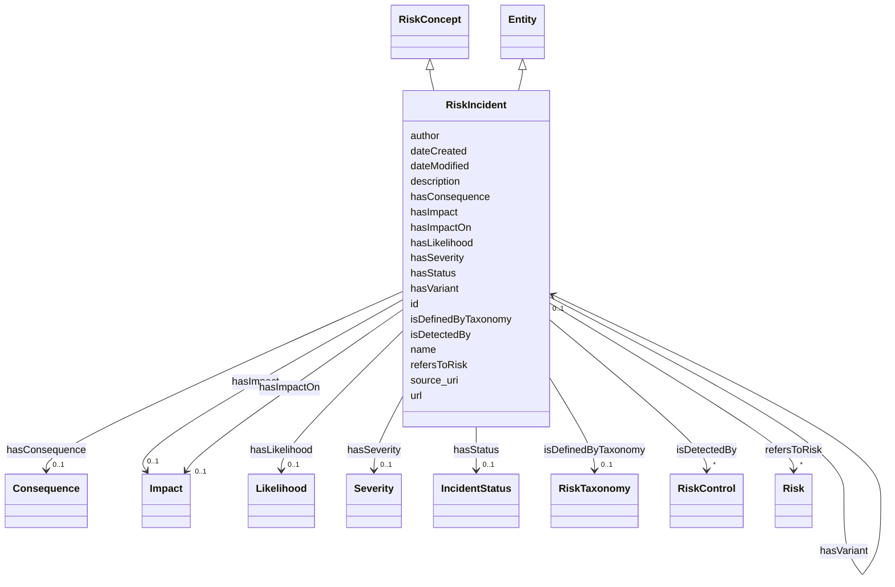

# Class: RiskIncident


_An event occuring or occured which is a realised or materialised risk._


URI: [https://w3id.org/dpv/risk#Incident](https://w3id.org/dpv/risk#Incident)





## Inheritance
* [Entity](Entity.md)
    * **RiskIncident** [ [RiskConcept](RiskConcept.md)]


## Slots

| Name | Cardinality and Range | Description | Inheritance |
| ---  | --- | --- | --- |
| [refersToRisk](refersToRisk.md) | * <br/> [Risk](Risk.md) | Indicates the incident (subject) is a materialisation of the indicated risk (... | direct |
| [isDefinedByTaxonomy](isDefinedByTaxonomy.md) | 0..1 <br/> [RiskTaxonomy](RiskTaxonomy.md) | A relationship where a risk or a risk group is defined by a risk taxonomy | direct |
| [hasStatus](hasStatus.md) | 0..1 <br/> [IncidentStatus](IncidentStatus.md) | Indicates the status of specified concept | direct |
| [hasSeverity](hasSeverity.md) | 0..1 <br/> [Severity](Severity.md) | Indicates the severity associated with a concept | direct |
| [hasLikelihood](hasLikelihood.md) | 0..1 <br/> [Likelihood](Likelihood.md) | The likelihood or probability or chance of something taking place or occuring | direct |
| [hasImpactOn](hasImpactOn.md) | 0..1 <br/> [Impact](Impact.md) | Indicates impact(s) possible or arising as consequences from specified concep... | direct |
| [hasConsequence](hasConsequence.md) | 0..1 <br/> [Consequence](Consequence.md) | Indicates consequence(s) possible or arising from specified concept | direct |
| [hasImpact](hasImpact.md) | 0..1 <br/> [Impact](Impact.md) | Indicates impact(s) possible or arising as consequences from specified concep... | direct |
| [hasVariant](hasVariant.md) | 0..1 <br/> [RiskIncident](RiskIncident.md) | Indicates an incident that shares the same causative factors, produces simila... | direct |
| [author](author.md) | 0..1 <br/> [String](String.md) | The author or authors of the incident report | direct |
| [source_uri](source_uri.md) | 0..1 <br/> [String](String.md) | The uri of the incident | direct |
| [isDetectedBy](isDetectedBy.md) | * <br/> [RiskControl](RiskControl.md) | A relationship where a risk, risk source, consequence, or impact is detected ... | [RiskConcept](RiskConcept.md) |
| [id](id.md) | 1 <br/> [String](String.md) | A unique identifier to this instance of the model element | [Entity](Entity.md) |
| [name](name.md) | 0..1 <br/> [String](String.md) | A text name of this instance | [Entity](Entity.md) |
| [description](description.md) | 0..1 <br/> [String](String.md) | The description of an entity | [Entity](Entity.md) |
| [url](url.md) | 0..1 <br/> [Uri](Uri.md) | An optional URL associated with this instance | [Entity](Entity.md) |
| [dateCreated](dateCreated.md) | 0..1 <br/> [Date](Date.md) | The date on which the entity was created | [Entity](Entity.md) |
| [dateModified](dateModified.md) | 0..1 <br/> [Date](Date.md) | The date on which the entity was most recently modified | [Entity](Entity.md) |


## Usages

| used by | used in | type | used |
| ---  | --- | --- | --- |
| [Container](Container.md) | [riskincidents](riskincidents.md) | range | [RiskIncident](RiskIncident.md) |
| [RiskIncident](RiskIncident.md) | [refersToRisk](refersToRisk.md) | domain | [RiskIncident](RiskIncident.md) |
| [RiskIncident](RiskIncident.md) | [hasVariant](hasVariant.md) | domain | [RiskIncident](RiskIncident.md) |
| [RiskIncident](RiskIncident.md) | [hasVariant](hasVariant.md) | range | [RiskIncident](RiskIncident.md) |


## Identifier and Mapping Information


### Schema Source


* from schema: https://ibm.github.io/risk-atlas-nexus/ontology/ai-risk-ontology


## Mappings

| Mapping Type | Mapped Value |
| ---  | ---  |
| self | https://w3id.org/dpv/risk#Incident |
| native | nexus:RiskIncident |


## LinkML Source

<!-- TODO: investigate https://stackoverflow.com/questions/37606292/how-to-create-tabbed-code-blocks-in-mkdocs-or-sphinx -->

### Direct

<details>
```yaml
name: RiskIncident
description: An event occuring or occured which is a realised or materialised risk.
from_schema: https://ibm.github.io/risk-atlas-nexus/ontology/ai-risk-ontology
is_a: Entity
mixins:
- RiskConcept
slots:
- refersToRisk
- isDefinedByTaxonomy
- hasStatus
- hasSeverity
- hasLikelihood
- hasImpactOn
- hasConsequence
- hasImpact
- hasVariant
attributes:
  author:
    name: author
    description: The author or authors of the incident report
    from_schema: https://ibm.github.io/risk-atlas-nexus/ontology/ai_risk
    rank: 1000
    domain_of:
    - RiskIncident
  source_uri:
    name: source_uri
    description: The uri of the incident
    from_schema: https://ibm.github.io/risk-atlas-nexus/ontology/ai_risk
    rank: 1000
    domain_of:
    - RiskIncident
class_uri: https://w3id.org/dpv/risk#Incident

```
</details>

### Induced

<details>
```yaml
name: RiskIncident
description: An event occuring or occured which is a realised or materialised risk.
from_schema: https://ibm.github.io/risk-atlas-nexus/ontology/ai-risk-ontology
is_a: Entity
mixins:
- RiskConcept
attributes:
  author:
    name: author
    description: The author or authors of the incident report
    from_schema: https://ibm.github.io/risk-atlas-nexus/ontology/ai_risk
    rank: 1000
    alias: author
    owner: RiskIncident
    domain_of:
    - RiskIncident
    range: string
  source_uri:
    name: source_uri
    description: The uri of the incident
    from_schema: https://ibm.github.io/risk-atlas-nexus/ontology/ai_risk
    rank: 1000
    alias: source_uri
    owner: RiskIncident
    domain_of:
    - RiskIncident
    range: string
  refersToRisk:
    name: refersToRisk
    description: Indicates the incident (subject) is a materialisation of the indicated
      risk (object)
    from_schema: https://ibm.github.io/risk-atlas-nexus/ontology/ai-risk-ontology
    exact_mappings:
    - dpv:refersToRisk
    rank: 1000
    domain: RiskIncident
    alias: refersToRisk
    owner: RiskIncident
    domain_of:
    - RiskIncident
    range: Risk
    multivalued: true
    inlined: false
  isDefinedByTaxonomy:
    name: isDefinedByTaxonomy
    description: A relationship where a risk or a risk group is defined by a risk
      taxonomy
    from_schema: https://ibm.github.io/risk-atlas-nexus/ontology/ai-risk-ontology
    rank: 1000
    slot_uri: schema:isPartOf
    alias: isDefinedByTaxonomy
    owner: RiskIncident
    domain_of:
    - RiskGroup
    - Risk
    - RiskControl
    - Action
    - RiskIncident
    range: RiskTaxonomy
  hasStatus:
    name: hasStatus
    description: Indicates the status of specified concept
    from_schema: https://ibm.github.io/risk-atlas-nexus/ontology/ai-risk-ontology
    rank: 1000
    domain: RiskConcept
    alias: hasStatus
    owner: RiskIncident
    domain_of:
    - RiskIncident
    range: IncidentStatus
  hasSeverity:
    name: hasSeverity
    description: Indicates the severity associated with a concept
    from_schema: https://ibm.github.io/risk-atlas-nexus/ontology/ai-risk-ontology
    rank: 1000
    domain: RiskConcept
    alias: hasSeverity
    owner: RiskIncident
    domain_of:
    - RiskIncident
    range: Severity
  hasLikelihood:
    name: hasLikelihood
    description: The likelihood or probability or chance of something taking place
      or occuring
    from_schema: https://ibm.github.io/risk-atlas-nexus/ontology/ai-risk-ontology
    rank: 1000
    domain: RiskConcept
    alias: hasLikelihood
    owner: RiskIncident
    domain_of:
    - RiskIncident
    range: Likelihood
  hasImpactOn:
    name: hasImpactOn
    description: Indicates impact(s) possible or arising as consequences from specified
      concept
    from_schema: https://ibm.github.io/risk-atlas-nexus/ontology/ai-risk-ontology
    broad_mappings:
    - dpv:hasConsequenceOn
    rank: 1000
    domain: RiskConcept
    alias: hasImpactOn
    owner: RiskIncident
    domain_of:
    - RiskIncident
    range: Impact
  hasConsequence:
    name: hasConsequence
    description: Indicates consequence(s) possible or arising from specified concept
    from_schema: https://ibm.github.io/risk-atlas-nexus/ontology/ai-risk-ontology
    rank: 1000
    domain: RiskConcept
    alias: hasConsequence
    owner: RiskIncident
    domain_of:
    - RiskIncident
    range: Consequence
  hasImpact:
    name: hasImpact
    description: Indicates impact(s) possible or arising as consequences from specified
      concept
    from_schema: https://ibm.github.io/risk-atlas-nexus/ontology/ai-risk-ontology
    broad_mappings:
    - dpv:hasConsequence
    rank: 1000
    domain: RiskConcept
    alias: hasImpact
    owner: RiskIncident
    domain_of:
    - RiskIncident
    range: Impact
  hasVariant:
    name: hasVariant
    description: 'Indicates an incident that shares the same causative factors, produces
      similar harms, and involves the same intelligent systems as a known AI incident. '
    from_schema: https://ibm.github.io/risk-atlas-nexus/ontology/ai-risk-ontology
    rank: 1000
    domain: RiskIncident
    alias: hasVariant
    owner: RiskIncident
    domain_of:
    - RiskIncident
    range: RiskIncident
  isDetectedBy:
    name: isDetectedBy
    description: A relationship where a risk, risk source, consequence, or impact
      is detected by a risk control.
    from_schema: https://ibm.github.io/risk-atlas-nexus/ontology/ai-risk-ontology
    rank: 1000
    domain: RiskConcept
    alias: isDetectedBy
    owner: RiskIncident
    domain_of:
    - RiskConcept
    inverse: detectsRiskConcept
    range: RiskControl
    multivalued: true
    inlined: false
  id:
    name: id
    description: A unique identifier to this instance of the model element. Example
      identifiers include UUID, URI, URN, etc.
    from_schema: https://ibm.github.io/risk-atlas-nexus/ontology/ai-risk-ontology
    rank: 1000
    slot_uri: schema:identifier
    identifier: true
    alias: id
    owner: RiskIncident
    domain_of:
    - Entity
    range: string
    required: true
  name:
    name: name
    description: A text name of this instance.
    from_schema: https://ibm.github.io/risk-atlas-nexus/ontology/ai-risk-ontology
    rank: 1000
    slot_uri: schema:name
    alias: name
    owner: RiskIncident
    domain_of:
    - Entity
    range: string
  description:
    name: description
    description: The description of an entity
    from_schema: https://ibm.github.io/risk-atlas-nexus/ontology/ai-risk-ontology
    rank: 1000
    slot_uri: schema:description
    alias: description
    owner: RiskIncident
    domain_of:
    - Entity
    range: string
  url:
    name: url
    description: An optional URL associated with this instance.
    from_schema: https://ibm.github.io/risk-atlas-nexus/ontology/ai-risk-ontology
    rank: 1000
    slot_uri: schema:url
    alias: url
    owner: RiskIncident
    domain_of:
    - Entity
    range: uri
  dateCreated:
    name: dateCreated
    description: The date on which the entity was created.
    from_schema: https://ibm.github.io/risk-atlas-nexus/ontology/ai-risk-ontology
    rank: 1000
    slot_uri: schema:dateCreated
    alias: dateCreated
    owner: RiskIncident
    domain_of:
    - Entity
    range: date
    required: false
  dateModified:
    name: dateModified
    description: The date on which the entity was most recently modified.
    from_schema: https://ibm.github.io/risk-atlas-nexus/ontology/ai-risk-ontology
    rank: 1000
    slot_uri: schema:dateModified
    alias: dateModified
    owner: RiskIncident
    domain_of:
    - Entity
    range: date
    required: false
class_uri: https://w3id.org/dpv/risk#Incident

```
</details>