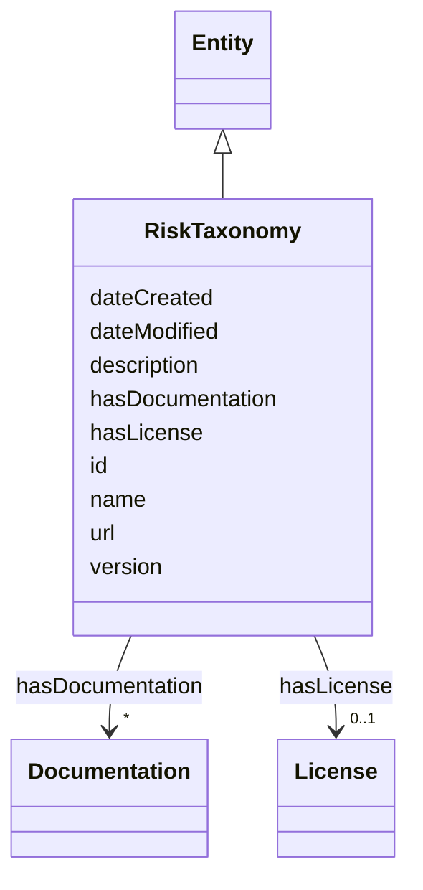

# Class: RiskTaxonomy


_A taxonomy of AI system related risks_


URI: [nexus:RiskTaxonomy](https://ibm.github.io/risk-atlas-nexus/ontology/RiskTaxonomy)





## Inheritance
* [Entity](Entity.md)
    * **RiskTaxonomy**


## Slots

| Name | Cardinality and Range | Description | Inheritance |
| ---  | --- | --- | --- |
| [version](version.md) | 0..1 <br/> [String](String.md) | The version of the entity embodied by a specified resource | direct |
| [hasDocumentation](hasDocumentation.md) | * <br/> [Documentation](Documentation.md) | Indicates documentation associated with an entity | direct |
| [hasLicense](hasLicense.md) | 0..1 <br/> [License](License.md) | Indicates licenses associated with a resource | direct |
| [id](id.md) | 1 <br/> [String](String.md) | A unique identifier to this instance of the model element | [Entity](Entity.md) |
| [name](name.md) | 0..1 <br/> [String](String.md) | A text name of this instance | [Entity](Entity.md) |
| [description](description.md) | 0..1 <br/> [String](String.md) | The description of an entity | [Entity](Entity.md) |
| [url](url.md) | 0..1 <br/> [Uri](Uri.md) | An optional URL associated with this instance | [Entity](Entity.md) |
| [dateCreated](dateCreated.md) | 0..1 <br/> [Date](Date.md) | The date on which the entity was created | [Entity](Entity.md) |
| [dateModified](dateModified.md) | 0..1 <br/> [Date](Date.md) | The date on which the entity was most recently modified | [Entity](Entity.md) |


## Usages

| used by | used in | type | used |
| ---  | --- | --- | --- |
| [Container](Container.md) | [taxonomies](taxonomies.md) | range | [RiskTaxonomy](RiskTaxonomy.md) |
| [RiskGroup](RiskGroup.md) | [isDefinedByTaxonomy](isDefinedByTaxonomy.md) | range | [RiskTaxonomy](RiskTaxonomy.md) |
| [Risk](Risk.md) | [isDefinedByTaxonomy](isDefinedByTaxonomy.md) | range | [RiskTaxonomy](RiskTaxonomy.md) |
| [RiskControl](RiskControl.md) | [isDefinedByTaxonomy](isDefinedByTaxonomy.md) | range | [RiskTaxonomy](RiskTaxonomy.md) |
| [Action](Action.md) | [isDefinedByTaxonomy](isDefinedByTaxonomy.md) | range | [RiskTaxonomy](RiskTaxonomy.md) |
| [RiskIncident](RiskIncident.md) | [isDefinedByTaxonomy](isDefinedByTaxonomy.md) | range | [RiskTaxonomy](RiskTaxonomy.md) |


## Identifier and Mapping Information


### Schema Source


* from schema: https://ibm.github.io/risk-atlas-nexus/ontology/ai-risk-ontology


## Mappings

| Mapping Type | Mapped Value |
| ---  | ---  |
| self | nexus:RiskTaxonomy |
| native | nexus:RiskTaxonomy |


## LinkML Source

<!-- TODO: investigate https://stackoverflow.com/questions/37606292/how-to-create-tabbed-code-blocks-in-mkdocs-or-sphinx -->

### Direct

<details>
```yaml
name: RiskTaxonomy
description: A taxonomy of AI system related risks
from_schema: https://ibm.github.io/risk-atlas-nexus/ontology/ai-risk-ontology
is_a: Entity
slots:
- version
- hasDocumentation
- hasLicense

```
</details>

### Induced

<details>
```yaml
name: RiskTaxonomy
description: A taxonomy of AI system related risks
from_schema: https://ibm.github.io/risk-atlas-nexus/ontology/ai-risk-ontology
is_a: Entity
attributes:
  version:
    name: version
    description: The version of the entity embodied by a specified resource.
    from_schema: https://ibm.github.io/risk-atlas-nexus/ontology/ai-risk-ontology
    rank: 1000
    slot_uri: schema:version
    alias: version
    owner: RiskTaxonomy
    domain_of:
    - License
    - RiskTaxonomy
    range: string
  hasDocumentation:
    name: hasDocumentation
    description: Indicates documentation associated with an entity.
    from_schema: https://ibm.github.io/risk-atlas-nexus/ontology/ai-risk-ontology
    rank: 1000
    slot_uri: airo:hasDocumentation
    alias: hasDocumentation
    owner: RiskTaxonomy
    domain_of:
    - Dataset
    - RiskTaxonomy
    - Action
    - AiEval
    - BenchmarkMetadataCard
    - BaseAi
    - LargeLanguageModelFamily
    range: Documentation
    multivalued: true
    inlined: false
  hasLicense:
    name: hasLicense
    description: Indicates licenses associated with a resource
    from_schema: https://ibm.github.io/risk-atlas-nexus/ontology/ai-risk-ontology
    rank: 1000
    slot_uri: airo:hasLicense
    alias: hasLicense
    owner: RiskTaxonomy
    domain_of:
    - Dataset
    - Documentation
    - RiskTaxonomy
    - AiEval
    - BenchmarkMetadataCard
    - BaseAi
    range: License
  id:
    name: id
    description: A unique identifier to this instance of the model element. Example
      identifiers include UUID, URI, URN, etc.
    from_schema: https://ibm.github.io/risk-atlas-nexus/ontology/ai-risk-ontology
    rank: 1000
    slot_uri: schema:identifier
    identifier: true
    alias: id
    owner: RiskTaxonomy
    domain_of:
    - Entity
    range: string
    required: true
  name:
    name: name
    description: A text name of this instance.
    from_schema: https://ibm.github.io/risk-atlas-nexus/ontology/ai-risk-ontology
    rank: 1000
    slot_uri: schema:name
    alias: name
    owner: RiskTaxonomy
    domain_of:
    - Entity
    - BenchmarkMetadataCard
    range: string
  description:
    name: description
    description: The description of an entity
    from_schema: https://ibm.github.io/risk-atlas-nexus/ontology/ai-risk-ontology
    rank: 1000
    slot_uri: schema:description
    alias: description
    owner: RiskTaxonomy
    domain_of:
    - Entity
    range: string
  url:
    name: url
    description: An optional URL associated with this instance.
    from_schema: https://ibm.github.io/risk-atlas-nexus/ontology/ai-risk-ontology
    rank: 1000
    slot_uri: schema:url
    alias: url
    owner: RiskTaxonomy
    domain_of:
    - Entity
    range: uri
  dateCreated:
    name: dateCreated
    description: The date on which the entity was created.
    from_schema: https://ibm.github.io/risk-atlas-nexus/ontology/ai-risk-ontology
    rank: 1000
    slot_uri: schema:dateCreated
    alias: dateCreated
    owner: RiskTaxonomy
    domain_of:
    - Entity
    range: date
    required: false
  dateModified:
    name: dateModified
    description: The date on which the entity was most recently modified.
    from_schema: https://ibm.github.io/risk-atlas-nexus/ontology/ai-risk-ontology
    rank: 1000
    slot_uri: schema:dateModified
    alias: dateModified
    owner: RiskTaxonomy
    domain_of:
    - Entity
    range: date
    required: false

```
</details>
